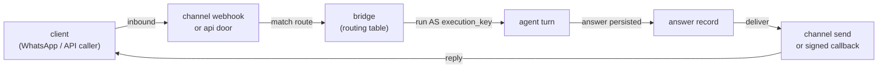

The conversation bridge turns an inbound message — from a messaging channel like
WhatsApp, Telegram, or Slack, or from an authed API caller — into an agent turn
whose answer is durably stored and delivered back to the client. One routing table
binds each inbound identity to the agent that answers it and the key that agent
runs as.

## The two doors

A message reaches the bridge through one of two doors, chosen per route:

- **`channel`** — a messaging provider's webhook delivers an inbound message. The
  route is matched by the `(channel, our_identity)` pair — the registry name of the
  channel and the medium address the client texted (a phone number, a chat, a Slack
  conversation). The answer is delivered back through the same channel's adapter,
  sent **from** the identity the client texted.
- **`api`** — an authed caller `POST`s to
  `/api/conversations/{route_name}/messages`. The answer is delivered by a signed
  HTTPS callback to the route's `callback_url`, or returned inline on a bounded
  sync wait.

## The routing table

A **route** is one row in the conversation routing table. It binds an inbound door
to the agent a turn runs and the execution key that turn runs as:

| Field | Meaning |
| --- | --- |
| `route_name` | A slug (`[a-z0-9-]+`); the handle and the thread-key namespace. |
| `door` | `channel` or `api`. |
| `agent_name` | The agent the turn runs — it must exist. |
| `execution_key` | The API-key identity the turn runs **as**. |
| `channel` / `our_identity` | `channel` rows: the registry name and the address texted. |
| `callback_url` | `api` rows: the HTTPS answer sink. |

A `channel` route's `(channel, our_identity)` pair is unique — a second route
claiming the same identity is refused at write, so every inbound message resolves
to exactly one route. Many rows may share one channel, each with its own identity,
so one provider account fans out to many agents.

Manage the table with the `tai conversations` CLI or the `/api/conversations`
routes; see the [bridge reference](/reference/conversation-bridge).

## How a route is authorized

Two authorities are separate and both live:

1. **Who may send.** A `channel` message is authenticated by the provider's own
   signature over the raw webhook body (fail-closed — an unsigned or mis-signed
   delivery is rejected and runs no turn). An `api` message is authenticated by the
   access-control gate on the send door: the caller needs a key authorized for that
   route.
2. **What the agent may do.** The turn runs as the route's bound `execution_key`,
   **not** as whoever sent the message. That key's live stored grants authorize the
   agent run and every tool call the turn makes.

Binding the execution key is a delegation decision taken when the route is created:
you may bind your own identity or a key you own, or any key as an admin (a
pass-role check). The key must be evaluable by a background execution — its stored
policy condition must be resolvable with no request token — or the bind is refused.

Because the turn is authorized against the key's **live** grants at fire time, you
revoke a route's authority by attenuating its key: drop a scope, disable it, delete
it, or narrow its owner, and the very next turn is denied. There is no
revocation-specific step. Scope the execution key (or the agent) to least privilege
— the turn can do exactly what that key can do, no more.

<Warning>
  A `public` trigger-auth hook can be fired by **anyone, with no credential** — so the
  bound `execution_key` is the **only** thing bounding what a fired hook can do. Treat the
  key as the security boundary: bind a **least-privilege** key, and **never** bind an admin
  or broad key to a `public` (or `token`) hook — that lets any caller act with those
  privileges. Use `verifier` or `api_key` triggers when the fire itself must be
  authenticated.
</Warning>

## The round trip

<Frame>

</Frame>

The inbound door returns as soon as the message is accepted and its answer record
persisted; the turn runs in the background and the answer is delivered when it
completes. A `channel` door returns the accepted id immediately; the `api` door
returns `202 {message_id, thread_id}`, or — with a bounded `wait_seconds` — `200`
carrying the answer inline when the turn finishes in time (its callback is then
suppressed so it never double-fires).

## Answer outcomes

Every accepted message gets a durable **answer record** that moves through a
delivery lifecycle:

- `accepted` — admitted, turn not yet complete (carries no answer).
- `pending_delivery` — the turn's answer is persisted and awaiting send; this is
  what a restart re-drives.
- `provisional` — sent, awaiting an out-of-band delivery receipt or a grace
  timeout.
- `delivered` — confirmed.
- `failed` — undelivered after the attempt budget, or reported failed by the
  provider (loud, retained, and listed on the admin failed-delivery door).
- `shed` — refused by the address rate cap; no turn ran.

A turn's own outcome is orthogonal: `answered`, or `error` — an `error` answer
carries generic client-safe text, never an internal detail. Delivery is retried
with backoff; a permanently undelivered answer ends `failed` rather than
disappearing.

Late failures surface too: a channel can send a `2xx` and then a `failed`
delivery-status webhook (a message rejected outside WhatsApp's 24-hour service
window arrives this way), which flips the record to `failed`.

## Conversation lifetime

A route's thread key is `bridge:{route_name}:{client_address}`, so each client
address holds its own conversation on a route and an agent remembers earlier turns
across separate inbound messages. Continuity is the checkpoint store's: with an
idle TTL configured (`checkpoint_ttl_minutes`), a thread idle past the lifetime is
swept and the next message starts fresh; with no TTL the thread is kept. See
[retention](/reference/conversation-bridge#checkpoint-retention).

Answer records carry their own retention: a record is kept for a retention window
after it reaches a terminal state, then expires with its indexes.

## See also

- [WhatsApp to an agent](/guides/whatsapp-to-agent) — both providers, end to end.
- [Connect your own system](/guides/connect-your-own-system) — the API door.
- [Telegram / Slack to an agent](/guides/telegram-slack-to-agent).
- [One bot, many skills](/guides/one-bot-many-skills) — a triage agent.
- [Conversation bridge reference](/reference/conversation-bridge) — CRUD, doors,
  the authorization model, and every setting.
