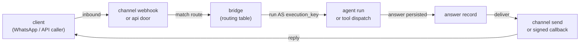

The conversation bridge turns an inbound message — from a messaging channel like
WhatsApp, Telegram, or Slack, or from an authed API caller — into a turn whose answer
is durably stored and delivered back to the client. One routing table binds each
inbound identity to what answers it — an **agent** run or a direct **tool** dispatch
— and the key that turn runs as.

## The two doors

A message reaches the bridge through one of two doors, chosen per route:

- **`channel`** — a messaging provider's webhook delivers an inbound message. The
  route is matched by the `(channel, our_identity)` pair — the registry name of the
  channel and the medium address the client texted (a phone number, a chat, a Slack
  conversation). The answer is delivered back through the same channel's adapter,
  sent **from** the identity the client texted.
- **`api`** — an authed caller `POST`s to
  `/api/conversations/{route_name}/messages`. The answer is delivered by a signed
  HTTPS callback to the route's `callback_url`, or returned inline on a bounded
  sync wait.

A blank or whitespace-only message is refused before any turn runs: the `api` door
answers `400`, and a channel drops it (logged, nothing sent back).

## The routing table

A **route** is one row in the conversation routing table. It binds an inbound door
to what a turn runs — an agent or a tool — and the execution key that turn runs as:

| Field | Meaning |
| --- | --- |
| `route_name` | A slug (`[a-z0-9-]+`); the handle and the thread-key namespace. |
| `door` | `channel` or `api`. |
| `target_kind` | `agent` (a threaded agent run) or `tool` (a stateless tool dispatch). |
| `target_name` | The agent or tool the turn runs — it must exist. |
| `execution_key` | The API-key identity the turn runs **as**. |
| `initial_mode` | The default [control mode](#control-mode-and-operator-messages): `agent` (run the turn) or `manual` (suppress it for an operator). |
| `payload_expr` / `reply_expr` | `tool` targets: jq mapping the message to the tool kwargs and the result to the reply. |
| `channel` / `our_identity` | `channel` rows: the registry name and the address texted. |
| `callback_url` | `api` rows: the HTTPS answer sink. |

A `channel` route's `(channel, our_identity)` pair is unique — a second route
claiming the same identity is refused at write, so every inbound message resolves
to exactly one route. Many rows may share one channel, each with its own identity,
so one provider account fans out to many targets.

Manage the table from the [Studio Conversations screen](/studio/screens#conversations),
the `tai conversations` CLI, or the `/api/conversations` routes; see the
[bridge reference](/reference/conversation-bridge).

### Agent and tool targets

A `target_kind` of **`agent`** runs a registered agent as the turn: it streams on the
route's thread, so the conversation carries memory across messages. A `target_kind`
of **`tool`** dispatches a registered tool **statelessly** — no conversation memory,
one message in and one reply out — with two optional jq programs shaping the call:

- **`payload_expr`** maps the inbound payload `{message, sender, our_identity,
  channel}` to the tool's kwargs; without it the kwargs are `{message, sender}`.
- **`reply_expr`** maps the tool's result to the reply text; without it the result
  must itself be a string or `null`. It only ever sees a **successful** result: a
  turn that ends on a non-success terminal status (`aborted`, `stopped`, `error`)
  skips the mapping and resolves as the client-safe `error` outcome instead.

The payload also carries a **`params`** object when the inbound entry supplied one —
a web-channel visitor's [link parameters](/plugins/tai42/channel-web#link-parameters),
the API message door's `params` field, or a channel's **tap enrichment** when a person
taps a control the flow offered: the tapped reply's author-set `id` arrives as
`params.reply_id` (a sectioned row's `description` as `params.reply_description` where
the medium carries it), a template quick-reply as `params.button_payload`, a
click-to-chat entry as its `referral_*` fields. All are string values reachable as
`.params.<name>`, present only when non-empty. They are untrusted transport the
platform caps and delivers but never signs or interprets; a value a flow must trust is
a secret the flow checks in its own store.

This is the **bridge-path** counterpart of the enrichment an
[answer](/concepts/interactions#enrichment-on-the-answer) carries: when a tap
**answers** a pending `ask_user` its context rides the answer's `params`, and when the
same tap is instead **bridged** as a fresh turn (no pending ask, or a `bridge`-policy
digression) it rides this payload `params` — the same enrichment on either arm, never
dropped.

A tool reply that is `null` or blank is a **deliberate silence** — the turn ran but
has nothing to say. On a `channel` route nothing is sent back (a terminal `silent`
record); on an `api` route the silence is communicated, delivered as a callback (or
sync-wait reply) whose `status` is `silent` and which carries no answer text. That
makes a tool target a way to answer some messages and stay quiet on others: a
published [flow preset](/concepts/presets), say, that replies only when it has
something to return. See the [bridge
reference](/reference/conversation-bridge#route-targets-agent-or-tool) for the exprs
in full.

A tool or flow target need not answer in one synchronous step either. Like an agent
target, its turn can async-park on an `ask_user` — pausing for a person's answer or
its expiry — and deliver its resumed reply back into the originating thread later,
mapped through the route's reply mapping.

### Structured guest messages

A guest message is always **text first**. When an inbound message carries a
structured object — an [ask-less form](/concepts/notifications#ask-less-forms)'s
submission — the text is a faithful rendering of the submission and stays the whole
turn every consumer sees: an `agent` target reads the text only, the transcript
records the text, and a form-unaware route behaves exactly as before. The structured
copy rides **beside** the text: a `tool` target's payload carries it under a `form`
key, present **only** when the inbound carried one, so an existing `payload_expr`
sees a byte-identical payload for a form-less inbound — a route maps the form
deliberately or not at all. The answer record keeps the object as `inbound_form`,
published on the admin and caller-safe reads alike.

The values are **untrusted guest data**: the platform bounds them as pure transport
(a serialized-size and nesting cap) and never validates them against the form's
schema — a submission is exactly as trustworthy as typed guest text, so a tool that
consumes one validates what it reads. The API [message door](/reference/conversation-bridge#the-message-door)
accepts the same shape: a `form` object beside the required `text`, under the same
bounds.

An inbound message may carry two more structured siblings the same way — **beside**
the text-first turn, delivered to a `tool` target's payload only when present:

- **`attachments`** — a list of `MediaItem`s the person sent with the text
  (image/document/video/audio), the inbound counterpart of an outbound answer's
  `media`. It rides under an `attachments` payload key.
- **`location`** — a geographic point the person shared, a `LocationElement`
  (latitude/longitude with an optional name/address). It rides under a `location`
  payload key.

Both follow the `form` pattern exactly: the `text` stays the whole turn every reader
(and every `agent` target) consumes, the structured copy is delivered only to a
form-/media-aware `tool` route, and a form-less, attachment-less, location-less
inbound is byte-identical to the pre-vocabulary payload. The values are the same
untrusted, transport-bounded guest data.

<Note>
On some channels an inbound attachment bridges as **params** rather than a typed
`attachments` entry — WhatsApp, for one, forwards an inbound media message with its
identity under `params.media_kind` / `params.media_id` (the Graph media id is not a
durable served-media source, so a consumer re-fetches the bytes with operator
credentials). An inbound **location** on that channel does land as a typed
`location`. What each channel bridges is documented on its
[plugin page](/plugins).
</Note>

### Rich, multi-message answers

A `tool` target need not answer with a single string. Its `reply_expr` (or, with no
expr, the tool's own result) may emit an ordered **array of parts** — each element
either a plain string (a text-only message) or an object carrying `message` with the
same rich forms a [notification](/concepts/notifications#what-a-notification-carries)
carries: `media` (image/document/video/audio files with an optional document
`filename`, plus links), a shared `location`, tappable `options`, a sectioned
`sections` list, a media `header` and text `footer`, a pre-approved `template`, or an
[ask-less form](/concepts/notifications#ask-less-forms)'s `schema`. The delivery
machine sends each part as its own message in order, so one turn can reply with
several bubbles, attach a document, share a pin, or offer tappable options. A part may
be **content-only** — an object with `media` or `location` and no text — for a
caption-less image or a bare pin. The array is strict: an unknown key or an empty
array is a loud error, never silently coerced, and each part obeys the same
[composition rules](/concepts/notifications#what-a-notification-carries) (`options`
XOR `sections`; `schema` excludes both; `header`/`footer` require a choice surface;
`template` stands alone) and the same per-channel
[capability gate](/concepts/notifications#channel-capability-matrix) — a channel
without the matching capability never receives the field.

`options` are the same **typed** shapes a notification uses — a `reply` (its `text`
becomes the person's next message; an author-set `id` echoes back on the next turn's
`params.reply_id`, and a `description` renders as a row's secondary line) or a `link`
(opens its `url`, submits nothing). A `template` carries its **named components**
(`header_media`, `body_parameters`, `buttons`) — the old flat `parameters` list is
**removed**.

Every reader that consumes a single answer string keeps working unchanged. The parts'
non-blank message texts are joined with a blank line into the same `answer` an `api`
callback, a bounded sync-wait, or a transcript reads, while a parts-aware consumer
reads the ordered parts and delivers each on its own. An `agent` target stays
single-string — ordered multi-message answers come from tool routes, which carry an
explicit reply contract.

## How a route is authorized

Two authorities are separate and both live:

1. **Who may send.** A `channel` message is authenticated by the provider's own
   signature over the raw webhook body (fail-closed — an unsigned or mis-signed
   delivery is rejected and runs no turn). An `api` message is authenticated by the
   access-control gate on the send door: the caller needs a key authorized for that
   route.
2. **What the turn may do.** The turn runs as the route's bound `execution_key`,
   **not** as whoever sent the message. That key's live stored grants authorize the
   agent run (or the `tool` target's dispatch) and every tool call the turn makes.

Binding the execution key is a delegation decision taken when the route is created:
you may bind your own identity or a key you own, or any key as an admin (a
pass-role check). The key must be evaluable by a background execution — its stored
policy condition must be resolvable with no request token — or the bind is refused.

Because the turn is authorized against the key's **live** grants at fire time, you
revoke a route's authority by attenuating its key: drop a scope, disable it, delete
it, or narrow its owner, and the very next turn is denied. There is no
revocation-specific step. Scope the execution key (or the agent) to least privilege
— the turn can do exactly what that key can do, no more.

<Warning>
  A `public` trigger-auth hook can be fired by **anyone, with no credential** — so the
  bound `execution_key` is the **only** thing bounding what a fired hook can do. Treat the
  key as the security boundary: bind a **least-privilege** key, and **never** bind an admin
  or broad key to a `public` (or `token`) hook — that lets any caller act with those
  privileges. Use `verifier` or `api_key` triggers when the fire itself must be
  authenticated.
</Warning>

## The round trip

<Frame>

</Frame>

The inbound door returns as soon as the message is accepted and its answer record
persisted; the turn runs in the background and the answer is delivered when it
completes. A `channel` door returns the accepted id immediately; the `api` door
returns `202 {message_id, thread_id}`, or — with a bounded `wait_seconds` — `200`
carrying the answer inline when the turn finishes in time (its callback is then
suppressed so it never double-fires).

## Answer outcomes

Every accepted message gets a durable **answer record** that moves through a
delivery lifecycle:

- `accepted` — admitted, turn not yet complete (carries no answer).
- `pending_delivery` — the turn's answer is persisted and awaiting send; this is
  what a restart re-drives.
- `provisional` — sent, awaiting an out-of-band delivery receipt or a grace
  timeout.
- `delivered` — confirmed.
- `failed` — undelivered after the attempt budget, or reported failed by the
  provider (loud, retained, and listed on the admin failed-delivery door).
- `shed` — refused by the address rate cap; no turn ran.
- `silent` — nothing is sent back for the inbound. It arises two ways: a **channel**
  `tool` turn whose mapped reply was `null` or blank, or a `manual`-mode inbound whose
  suppressed target turn produced no reply (see [control
  mode](#control-mode-and-operator-messages)) — a due pairing reply or first-contact
  greeting is sent instead, so those are *not* silent. On an **api** route the silence is
  communicated instead — the record ends `delivered`, its callback carrying
  `status: "silent"` and no answer.

A turn's own outcome is orthogonal: `answered`, `error`, or `silent` — an `error`
answer carries generic client-safe text, never an internal detail, and a `silent`
outcome carries no answer text at all. Delivery is retried
with backoff; a permanently undelivered answer ends `failed` rather than
disappearing.

Late failures surface too: a channel can send a `2xx` and then a `failed`
delivery-status webhook (a message rejected outside WhatsApp's 24-hour service
window arrives this way), which flips the record to `failed`.

## Control mode and operator messages

Every thread runs in one of two **control modes**, and the route carries the default:

- **`agent`** (the default) — an inbound message buys a **target turn**: the agent run
  or the tool dispatch answers it, exactly as [the round trip](#the-round-trip)
  describes.
- **`manual`** — the target turn is **suppressed**. The inbound is recorded but the
  flow does not answer it, so a human answers by hand. The platform's own control
  turns are unaffected: pairing and the first-contact greeting still run.

A route's `initial_mode` is the default; a per-thread override wins over it, so the
mode in force for a thread is its override when one is set, else the route default. A
linked person's aggregated thread with no override defaults to `manual` when **any**
route the person spans sets `initial_mode: manual`, else `agent` — one operator control
decision covers every channel they paired. The override carries the answer records'
retention TTL and is **refreshed on thread activity** — each accepted inbound and each
operator send — so it expires *with* the conversation: a thread that falls quiet past
the retention window loses its override along with its records, and a returning address
starts again at the route default. An explicit thread
[delete](#conversation-lifetime), or a route delete, reclaims it at once.

`manual` is valid for **every** target — a `manual` `initial_mode`, a `PUT
…/thread/mode`, and the `set_conversation_mode` builtin all take it, on a `tool` target
or an agent alike.

In `manual` mode the client gets **no automatic answer** to an ordinary inbound: its
target turn is suppressed, so on a `channel` route the record ends terminal `silent`
and on an `api` route the silence is delivered as a `status: "silent"` marker. The
platform's own control turns are the exception — a pairing action still gets its reply,
and on a multichannel route a due first-contact greeting still runs: it is prepended
onto the otherwise-silent outcome, so **that** record ends `answered` and is delivered
carrying the greeting text. Whether the suppressed inbound is **remembered** turns on
the target's memory: a target that keeps thread memory — an agent that implements the
thread-memory append — has it **appended to that memory**, so a later agent turn once
the thread is back in `agent` mode reads it as prior context; a target with no thread
memory — a `tool` target, or an agent without the append — skips the step, its
transcript standing as the record. An append that fails is a loud `error` outcome, never
a silent drop.

Three parties flip the switch:

- **An operator**, on a named thread — the Studio's [Conversations
  screen](/studio/screens#conversations) toggle, `tai conversations mode-set`, or the
  `PUT …/thread/mode` door.
- **The agent itself**, from inside its own turn, with the `set_conversation_mode`
  builtin tool — it flips the **current** conversation (the thread the turn runs on),
  so a flow can hand its own conversation off to a human. The tool reads the live
  thread from the turn context and names none; called outside a turn it refuses loudly.
- **An external system**, through the same `PUT …/thread/mode` door, which names its
  thread explicitly.

### Operator messages

An operator answers a thread **by hand** with `tai conversations send` (the
`POST …/thread/messages` door) or the Studio compose box. No turn runs: the message is
stored already answered and **delivered through the same machine a produced answer
takes** — sent from the route identity, with the same chunking, ledger, and receipts.
An operator reply may itself carry **media**, tappable **options** (the same
[typed reply/link shapes](/concepts/notifications#media-kinds-and-typed-options)), a
pre-approved **template**, or an [ask-less form](/concepts/notifications#ask-less-forms)'s
**schema** — the same rich content a produced answer can — validated up front so a bad
attachment is a clean rejection rather than a failed send. It is allowed in **either** mode and **never
flips the mode**.

The record is marked `origin: "operator"` (a client turn's record is `origin:
"client"`): it carries the operator's text as its `answer`, an empty `inbound_text`,
and names the sending operator. For a target that **keeps thread memory** the text is
appended to the thread's memory as an `assistant` reply — the same conditional append a
suppressed inbound takes, mirroring how the agent's own answer enters memory — **before**
the record is created, so a later agent turn reads the operator's reply as prior context;
a target with no memory skips it. An append that fails is loud and no record is created.
Memory stays continuous both ways: a manual-mode inbound the flow never answered and the
operator's own reply both sit in the thread the agent resumes on.

On a linked person's aggregated thread the reply returns to the address they last wrote
from, or to an explicit `address` that must be one of the person's. Sending is the
door's **write** action — the same grant that creates a route — and an unauthenticated
caller is refused (`501`), since an operator action must be attributable. See [operator
messages and control mode](/reference/conversation-bridge#operator-messages-and-control-mode).

## Watching a route's conversations

Every route's threads and their transcripts are readable while they are retained,
whichever door the messages arrived through. An operator reads them on the Studio's
[Conversations screen](/studio/screens#conversations) — a route picker, a thread
list, and a live-tailing transcript — or from the CLI with
[`tai conversations threads`](/reference/cli/conversations) and
`tai conversations transcript`. A thread listing spans every caller on its route, so
the listing is admin-only; a transcript read takes the same conversations read grant.
See [the read doors](/reference/conversation-bridge#the-read-doors).

The listing narrows with `?status=` (a delivery-status the thread's newest record must
match) and `?address=` (a substring of the thread id's client-address suffix); a transcript
narrows with `?q=` (records whose inbound text or answer contains the substring); and
`GET …/messages/search?q=` searches every record on the route. None has a dedicated index, so
each is a **bounded post-scan** whose envelope carries a `truncated` flag — `true` when a page
spent its scan budget before the route was exhausted, so a client never mistakes a bounded
page for the whole result. See [the read
doors](/reference/conversation-bridge#the-read-doors).

Each transcript record carries its `origin` — `client` for an inbound turn, `operator`
for a by-hand reply — so an operator's messages read as distinct from the flow's. From
the same Studio screen an operator can also flip the thread's [control
mode](#control-mode-and-operator-messages) and compose a reply by hand.

## Conversation lifetime

A route's thread key is `bridge:{route_name}:{client_address}`, so each client address
holds its own conversation on a route and an `agent` remembers earlier turns across
separate inbound messages. On any target with multichannel on, a linked person — one
whose sending address is paired to more than one address — instead keys the aggregated
`bridge:@person:{person_id}` thread, so all of that person's paired channels share one
thread; every other sender keeps the `bridge:{route_name}:{client_address}` key.
Continuity is the checkpoint store's: with an
idle TTL configured (`checkpoint_ttl_minutes`), a thread idle past the lifetime is
swept and the next message starts fresh; with no TTL the thread is kept. See
[retention](/reference/conversation-bridge#checkpoint-retention).

An operator can also **forget** one thread outright — its checkpoint, its answer
records, and its indexes — with
[`tai conversations delete-thread`](/reference/cli/conversations) (the
`DELETE …/thread` door), so the next message on that address starts fresh without
waiting for a TTL. Forgetting is authorized by the same write grant that creates the
route, and a valid id on its own route always succeeds. See [forgetting a
thread](/reference/conversation-bridge#forgetting-a-thread).

A **linked person** can be erased ENTIRELY with
[`tai conversations delete-person`](/reference/cli/conversations) (the
`DELETE …/persons/{person_id}` door): its aggregated `bridge:@person:{id}` thread (checkpoint,
records, indexes), its person row, and every address→person index mapping go together, so the
next message from any of its addresses starts as a fresh provisional person. The erase is
idempotent — a person already gone is not an error. See [forgetting a
person](/reference/conversation-bridge#forgetting-a-person).

A `tool` target keeps no **conversation** memory: the dispatch is stateless, so no
conversation state is carried across messages and each message is answered on its own. Its thread key
still groups that route's answer records and transcripts and orders its turns; there is
simply no checkpoint to remember or expire. When the target's multichannel is on the
payload carries `person_id` and `person_addresses`, so a tool can anchor its own
continuity on that channel-stable person even though the platform keeps no conversation
memory for it.

Answer records carry their own retention: a record is kept for a retention window
after it reaches a terminal state, then expires with its indexes.

## See also

- [WhatsApp to an agent](/guides/whatsapp-to-agent) — both providers, end to end.
- [Connect your own system](/guides/connect-your-own-system) — the API door.
- [Telegram / Slack to an agent](/guides/telegram-slack-to-agent).
- [One bot, many skills](/guides/one-bot-many-skills) — a relay agent.
- [Conversation bridge reference](/reference/conversation-bridge) — CRUD, doors,
  the authorization model, and every setting.
