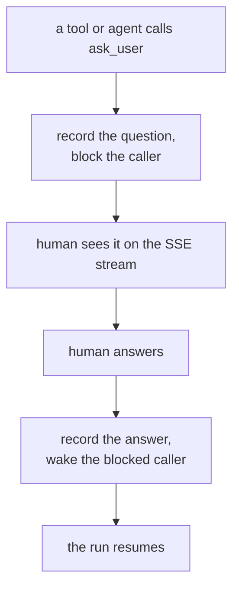

An interaction pauses a run to ask a person a question and blocks until they
answer or the question times out. The `ask_user` tool is the core capability: it
suspends the caller mid-run, records the question, and wakes the caller with the
answer.

This page explains the model. To turn interactions on and answer one, follow
[Use interactions](/guides/use-interactions).

## The loop



`ask_user` is the engine-agnostic author surface behind the contract's `AskUser`
protocol. Loading it is manifest-driven: opt in the interactions tool module and
the interactions HTTP router, exactly like any other capability.

## Answer formats

A question declares one of five answer formats. Four are answered on an
authenticated **in-client** surface — the caller waits while a person responds
through the answer door:

- **`text`** — free text.
- **`confirm`** — a yes/no acknowledgement.
- **`select`** — a choice from options.
- **`form`** — a typed payload validated against a declared schema.

The fifth format is **`external`**: the human acts on an outside surface — signs a
document, approves a request, pays — and the external system delivers the answer
back through a public callback door. The asking tool blocks exactly as it does for
any other format; only the delivery channel differs.

## Media on a question

A question can carry optional **media** — images and links shown WITH it in the
inbox, above the answer controls. Media is **display-only**: the person still
answers through the question's `answer_format`, and the media never becomes part
of the answer. It is orthogonal to the answer format — valid with every one — and
renders with the question both while it is pending and after it is answered.

<Frame caption="The Interactions inbox rendering a question's media — images and links shown above the answer controls.">
  
  
</Frame>

Each item is a `MediaItem` — a `kind`, a `url`, and an optional `caption`:

```json
{"kind": "image", "url": "https://cdn.example.com/tote.png", "caption": "The compact tote in sand canvas"}
{"kind": "link",  "url": "https://shop.example.com/tote",    "caption": "View the compact tote"}
```

- **`kind`** — `image` renders inline; `link` renders as a labelled anchor.
- **`url`** — the source. An `image` is an absolute **`https`** URL or a
  `data:image/*` URI; a `link` is an absolute **`http(s)`** URL. Remote images
  are https-only: the inbox content-security policy admits `https:` and `data:`
  image sources but not `http:`, so an `http:` image would be a record that could
  never render — it is rejected up front, not silently dropped. Anchors are not
  governed by that policy, so an `http:` link stays valid.
- **`caption`** — optional accessibility text: an image's alt text or a link's
  display label.

### Caps

Media is bounded by the contract. These are wire-contract properties — they bound
the durable record and the stream frame it is replayed in — not operator settings:

| Cap | Value | What it bounds |
|---|---|---|
| `MEDIA_MAX_ITEMS` | 8 | items on one question |
| `MEDIA_URL_MAX_CHARS` | 8192 | one `http(s)`/`https` URL |
| `MEDIA_DATA_URI_MAX_CHARS` | 524288 (512 KiB) | one inline `data:image/*` URI |
| `MEDIA_CAPTION_MAX_CHARS` | 1000 | one caption |
| `MEDIA_TOTAL_URI_CHARS` | 1048576 (1 MiB) | the summed url text across all items |

The per-question total budget is load-bearing beyond the per-item cap: the pending
inbox backlog is replayed whole to every stream consumer on every (re)connect, so a
per-question ceiling bounds a bytes × pending × clients amplification the per-item
cap alone does not.

### Limits

- **Display-only.** Media rides the question, never the answer. The person's
  reply carries no media.
- **Not forwarded to channels.** A question always persists to the inbox, where
  its media renders. When the same question is also delivered to a
  [channel](#delivering-to-a-channel), only the question text is forwarded — the
  media stays in the inbox.
- **Privacy.** A remote `https` image is fetched directly by the reader's
  browser, which discloses the reader's IP (and request timing) to the image
  host. An agent that must avoid that discloses nothing by using a `data:image/*`
  URI (the image travels inline in the record) or a same-origin URL the
  deployment serves itself.
- **Validated before anything is stored.** Invalid media — an empty list, a
  non-`http(s)` link, a non-`https`/non-`data:image` image, an over-cap url,
  data URI, caption, or total, a blank caption, or more than `MEDIA_MAX_ITEMS`
  items — raises loudly when the question is built, before any state is written.

## External questions

An `external` question requires a `link`. A string link is a template carrying the
literal `{callback_url}` placeholder; a callable link receives the callback URL,
builds the external resource, and returns its final URL. The returned answer is the
payload the callback delivered — a JSON POST body, or the query params of a
GET confirm flow — validated against the question's schema when one is declared.

`ask_external` packages this as a [transformer extension](/concepts/tools-and-extensions):
it wraps a tool that builds an external resource and drives the whole flow. The
wrapped tool takes a `callback_url` parameter and returns the URL to visit.

## Delivering to a channel

By default a pending question surfaces on the authenticated stream — the Studio
inbox. Passing `channel="<name>"` to `ask_user` hands delivery to a registered
**channel plugin** (Telegram, Slack, SMS/WhatsApp) instead: the question mints a
public callback ticket exactly like an `external` ask, the plugin pushes it to
the person on that medium, and the reply comes back through the same callback
door. The asking tool blocks exactly as before — only the delivery leg changes.
An unknown channel name, or a delivery failure, raises loudly before the run
would wait on an answer that can never arrive.

A channel may render a `select` question **natively** — WhatsApp, for instance,
shows the options as tappable reply buttons or a list, and past the medium's
option cap it falls back to a numbered text prompt. How the options render is the
channel's choice; the **answer contract is unchanged**. However the person
responds — tapping a control or typing — the answer is the option **text**,
exactly as a typed reply would deliver it, and it validates against the
question's options the same way.

## The doors

The interactions surface exposes four HTTP doors. Two are authenticated and two
are public:

| Door | Auth | Purpose |
|---|---|---|
| `GET /api/interactions/stream` | authenticated | SSE feed of pending questions |
| `POST /api/interactions/{id}/answer` | authenticated | the human answer door (in-client formats) |
| `POST /api/interactions/callback/{ticket}` | **public** | the data door — sensitive answers ride the JSON body |
| `GET /api/interactions/callback/{ticket}` | **public** | the redirect door — serves a confirm page |

Publicness is an [access-control](/concepts/access-control) configuration decision,
not a property of the route code.

## Security in brief

- **The ticket is the capability.** It is a high-entropy bearer token that expires
  on its TTL; single use is enforced by an answered-state guard, and a provider
  retry against a live ticket gets an idempotent `200 already_answered`.
- **GET never mutates.** Link scanners prefetch URLs, so the GET door serves a
  byte-constant confirm page whose form POSTs back — the human's click performs
  the claim.
- **Uniform 404 and no reflected input.** Unknown, expired, and pruned tickets
  return the same response; callback pages interpolate no request-derived value.
- **Signature verification** runs in core. Bind a
  [webhook verifier](/concepts/triggers-and-webhooks) to an external question and
  the POST door verifies the raw body before the answer is accepted — failing
  closed.

<Note>
External questions require `INTERACTIONS_PUBLIC_BASE_URL` (an `https://` origin,
since the callback URL is a bearer capability) and Redis 7.0+. Callback payloads
arrive through an unauthenticated door, so every stream consumer must treat them
as untrusted.
</Note>

The [use-interactions guide](/guides/use-interactions) walks `ask_user` across the
answer formats and wires an `ask_external` callback end to end. See the
[HTTP API reference](/reference/api/index) for the interaction routes and the
[CLI reference](/reference/cli/index) for `tai interactions`.
