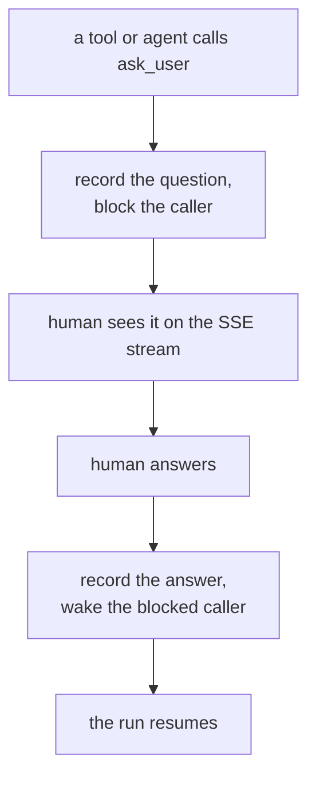

An interaction pauses a run to ask a person a question and blocks until they
answer or the question times out. The `ask_user` tool is the core capability: it
suspends the caller mid-run, records the question, and wakes the caller with the
answer.

This page explains the model. To turn interactions on and answer one, follow
[Use interactions](/guides/use-interactions).

## The loop



`ask_user` is the engine-agnostic author surface behind the contract's `AskUser`
protocol. Loading it is manifest-driven: opt in the interactions tool module and
the interactions HTTP router, exactly like any other capability.

## Sync and async

A question also declares a **wait discipline**, `mode`:

- **`sync`** (the default) blocks the caller. The loop above is the sync loop: the
  caller waits on the answer or the `timeout`, then the typed answer returns (or the
  call raises).
- **`async`** parks the caller. `ask_user` records — and, over a channel, delivers —
  the question exactly as sync does, but returns a **suspension sentinel**
  immediately instead of blocking. A later answer, or the question's expiry, resumes
  the run out of band.

An async park always carries a deadline: `expiry_at`, a timezone-aware moment. It is
**required** for `async` — a park with no deadline could never expire, so the ask
raises without it — and **mutually exclusive** with a sync `timeout`, which bounds
the same wait the other way. `expiry_at` is valid only with `mode="async"`.

A parked question is answered **out of band** — through the ordinary authenticated
answer door or the channel callback, exactly as a sync question, never inline. When
it resolves — a human answers, or `expiry_at` passes with no answer — the run
resumes on its own: a stored continuation runs under the **asker's** identity (never
the answerer's), exactly once. On expiry the continuation receives a reserved
*interaction expired* marker in place of an answer, so the run takes its expiry
branch rather than a real answer.

Async requires the run to be resumable: it must be raised where a resuming driver
and a bound execution identity are in scope, or it raises loudly rather than
silently blocking.

Async also requires a **durable, cross-worker checkpointer** — `redis` or
`postgres`. The continuation may resume on a different worker than the one that
parked the run, so its checkpoint must live in shared storage; an in-memory,
sqlite, or checkpointing-disabled setup cannot cross that boundary, and an async
park on one raises loudly.

### Parking several at once

A run can raise more than one async `ask_user` before it suspends — a parallel
fan-out that parks on all of them together. Each ask is independent: it carries its
own `expiry_at`, and its answer or expiry can arrive in any order, from any surface,
on any worker. The run buffers each resolution durably and resumes **once**, when
the **last** ask resolves — never once per answer, and never part-way on a partial
set. A mix of real answers and expiries resolves the same way: an expired ask
contributes the reserved *interaction expired* marker to its own branch while its
siblings contribute their answers, and the single resume carries them all together.
A lone async ask is the one-ask case of this same path.

### A flow or an agent parks

The resuming driver is engine-agnostic: a flow and an agent run are both drivers.
An agent whose tool raises an async `ask_user` parks the whole agent run and resumes
it on the answer or expiry exactly as a flow resumes — the same stored continuation,
the same asker identity, the same once-only resume. Parking an agent run needs the
same durable, cross-worker checkpointer as any park (`redis` or `postgres`); an agent
run on an in-memory or sqlite checkpointer refuses the async ask loudly rather than
parking a run nothing could resume. It also needs the agents package's own durable
park index — a configured Redis that reverses a parked interaction id back to the
run that parked it, independent of the checkpoint provider; a park-capable run with
no park index configured refuses the async ask loudly before any state is written.

Parallel subagents each park in one step: when several nested subagents raise an
async `ask_user` together, all their parks collapse into one suspend, and the run
resumes **once** when the last of them resolves — answers and expiries arriving in
any order, from any surface, on any worker, exactly as parallel asks resolve on a
flow.

When a parked agent was reached over a chat channel, its resumed final reply is
posted back into the originating conversation thread, so the late answer lands where
the person is talking.

### Deadlines and retention

An async ask's `expiry_at` is the **deadline** — the moment the question stops
mattering, which drives its expiry branch. The **checkpoint retention** is a
different clock: the paused run's checkpoint lives in the checkpointer's own store,
kept for a bounded horizon (30 days by default) before a sweep reclaims the idle
thread. The two must agree. If a paused run's checkpointer evicts idle threads at a
bounded retention horizon, an async ask whose `expiry_at` lies beyond that horizon
would lose its paused graph before the answer or expiry ever arrives — so the park
is refused **loudly when it suspends**, naming the interaction, its `expiry_at`, and
the horizon it exceeded. A keep-forever retention has no horizon and never refuses.

## Answer formats

A question declares one of five answer formats. Four are answered on an
authenticated **in-client** surface — the caller waits while a person responds
through the answer door:

- **`text`** — free text.
- **`confirm`** — a yes/no acknowledgement.
- **`select`** — a choice from options.
- **`form`** — a typed payload validated against a declared schema. Answered
  in-client through the answer door, or — over a [channel](#delivering-to-a-channel)
  that supports forms — as an in-chat form: a web widget, a Slack modal, a WhatsApp
  Flow, or a webview of the schema-rendered callback form page (the generic surface
  behind them).

The fifth format is **`external`**: the human acts on an outside surface — signs a
document, approves a request, pays — and the external system delivers the answer
back through a public callback door. The asking tool blocks exactly as it does for
any other format; only the delivery channel differs.

## Media on a question

A question can carry optional **media** — images and links shown WITH it in the
inbox, above the answer controls. Media is **display-only**: the person still
answers through the question's `answer_format`, and the media never becomes part
of the answer. It is orthogonal to the answer format — valid with every one — and
renders with the question both while it is pending and after it is answered.

<Frame caption="The Interactions inbox rendering a question's media — images and links shown above the answer controls.">
  
  
</Frame>

Each item is a `MediaItem` — a `kind`, a `url`, and an optional `caption`:

```json
{"kind": "image", "url": "https://cdn.example.com/chart.png", "caption": "The weekly chart"}
{"kind": "link",  "url": "https://docs.example.com/reports",  "caption": "Open the full report"}
```

- **`kind`** — `image` renders inline; `link` renders as a labelled anchor.
- **`url`** — the source. An `image` is an absolute **`https`** URL, a
  `data:image/*` URI, or a same-origin **`/api/interactions/media/<id>`** reference
  to media the deployment serves by id; a `link` is an absolute **`http(s)`** URL.
  Remote images are https-only: the inbox content-security policy admits `https:`,
  `data:`, and same-origin image sources but not `http:`, so an `http:` image would
  be a record that could never render — it is rejected up front, not silently
  dropped. Anchors are not governed by that policy, so an `http:` link stays valid.
- **`caption`** — optional accessibility text: an image's alt text or a link's
  display label.

### Caps

Media and the question text are bounded by the contract. These are wire-contract
properties — they bound the ask (and notify) **request** a tool submits, not a
replay — not operator settings:

| Cap | Value | What it bounds |
|---|---|---|
| `QUESTION_MAX_CHARS` | 8192 | one question's text |
| `MEDIA_MAX_ITEMS` | 50 | items on one ask or notify — a loose abuse guard |
| `MEDIA_URL_MAX_CHARS` | 8192 | one `http(s)`/`https` URL |
| `MEDIA_DATA_URI_MAX_CHARS` | 524288 (512 KiB) | one submitted `data:image/*` URI |
| `MEDIA_CAPTION_MAX_CHARS` | 1000 | one caption |
| `MEDIA_TOTAL_URI_CHARS` | 1048576 (1 MiB) | the summed url text across all items |

`MEDIA_MAX_ITEMS` is a loose platform abuse guard on the item count, not a
per-channel limit: WhatsApp, for one, delivers each image as its own message, so
the guard — not a native per-message envelope — bounds how many items an ask or
notify may carry. The byte caps
bound the submitted request, not a replay: an accepted `data:image/*` image is
stored by reference — the record keeps a same-origin `/api/interactions/media/<id>`
url and the bytes are served from that route for the question's lifetime. The
pending inbox is read as a paged list through `GET /api/interactions`, and the SSE
stream is tail-only, so nothing is replayed whole on (re)connect.

### Limits

- **Display-only.** Media rides the question, never the answer. The person's
  reply carries no media.
- **Not forwarded to channels.** A question always persists to the inbox, where
  its media renders. When the same question is also delivered to a
  [channel](#delivering-to-a-channel), only the question text is forwarded — the
  media stays in the inbox.
- **Privacy.** A remote `https` image is fetched directly by the reader's
  browser, which discloses the reader's IP (and request timing) to the image
  host. An agent that must avoid that discloses nothing by submitting a
  `data:image/*` URI — the deployment stores it by reference and serves the bytes
  from its own `/api/interactions/media/<id>` route, so the reader's browser only
  ever contacts the deployment.
- **Validated before anything is stored.** Invalid media — an empty list, a
  non-`http(s)` link, an image url that is neither `https`, a `data:image/*` URI,
  nor a same-origin `/api/interactions/media/<id>` reference, an over-cap url,
  data URI, caption, or total, a blank caption, or more than `MEDIA_MAX_ITEMS`
  items — raises loudly when the question is built, before any state is written.

## External questions

An `external` question requires a `link`. A string link is a template carrying the
literal `{callback_url}` placeholder; a callable link receives the callback URL,
builds the external resource, and returns its final URL. The returned answer is the
payload the callback delivered — a JSON POST body, or the query params of a
GET confirm flow — validated against the question's schema when one is declared.

`ask_external` packages this as a [transformer extension](/concepts/tools-and-extensions):
it wraps a tool that builds an external resource and drives the whole flow. The
wrapped tool takes a `callback_url` parameter and returns the URL to visit.

## Delivering to a channel

By default a pending question surfaces on the authenticated stream — the Studio
inbox. Passing `channel="<name>"` to `ask_user` hands delivery to a registered
**channel plugin** (Telegram, Slack, SMS/WhatsApp) instead: the question mints a
public callback ticket exactly like an `external` ask, the plugin pushes it to
the person on that medium, and the reply comes back through the same callback
door. The asking tool blocks exactly as before — only the delivery leg changes.
An unknown channel name, or a delivery failure, raises loudly before the run
would wait on an answer that can never arrive.

A reply that arrives after the question is already gone or expired is not lost:
with a channel route bound it enters the conversation as an ordinary inbound
message; with no bound route it is logged and dropped.

A channel may render a `select` question **natively** — WhatsApp, for instance,
shows the options as tappable reply buttons or a list, and past the medium's
option cap it falls back to a numbered text prompt. How the options render is the
channel's choice; the **answer contract is unchanged**. However the person
responds — tapping a control or typing — the answer is the option **text**,
exactly as a typed reply would deliver it, and it validates against the
question's options the same way.

A `form` question rides a channel only when that channel advertises
`supports_form_delivery`; a form sent to a channel without the flag raises loudly,
naming it, before anything is sent. The person fills it natively — a web form
widget, a Slack modal, a WhatsApp Flow, or a Telegram webview of the
schema-rendered callback form page — and the typed answer returns through the
callback door, validated against the schema exactly as the in-client door validates
it.

Because a channel form is answered on the server-rendered callback page, its
`schema` must fall in a renderable **subset**, checked when the question is asked —
before anything is stored. The root is `{"type": "object"}` with a non-empty
`properties` map; every property is a scalar (`string`, `boolean`, `integer`, or
`number`); an `enum` — a non-empty list of strings — is allowed only on a `string`
property; and `required`, when present, names only declared properties. A property
without a scalar `type` — a nested object, an array, a bare `anyOf`/`oneOf`/`$ref`,
a missing type — is refused with a `ValueError` naming the property, while an extra
constraint keyword alongside a scalar `type` is not rendered but is enforced when
the answer is validated. A form on the default inbox surface keeps full
JSON-schema freedom; the subset binds only a channel-delivered form.

## The doors

The interactions surface exposes six HTTP doors. Three are authenticated and three
are public:

| Door | Auth | Purpose |
|---|---|---|
| `GET /api/interactions` | authenticated | paged list of pending questions (`page`/`pageSize`) |
| `GET /api/interactions/stream` | authenticated | tail-only SSE feed of live `add`/`answered`/`removed` frames |
| `POST /api/interactions/{id}/answer` | authenticated | the human answer door (in-client formats) |
| `GET /api/interactions/media/{id}` | **public** | serves media stored by reference — the id is the capability |
| `POST /api/interactions/callback/{ticket}` | **public** | the data door — sensitive answers ride the JSON body |
| `GET /api/interactions/callback/{ticket}` | **public** | the redirect door — serves a confirm or schema-rendered form page |

Publicness is an [access-control](/concepts/access-control) configuration decision,
not a property of the route code.

## Security in brief

- **The ticket is the capability.** It is a high-entropy bearer token that expires
  on its TTL; single use is enforced by an answered-state guard, and a provider
  retry against a live ticket gets an idempotent `200 already_answered`.
- **GET never mutates.** Link scanners prefetch URLs, so the GET door serves a
  byte-constant confirm page — or, for a channel-delivered form, a page rendered
  from the stored schema — whose form POSTs back; the human's submit performs the
  claim.
- **Uniform 404 and no reflected input.** Unknown, expired, and pruned tickets
  return the same response; callback pages interpolate no request-derived value.
- **Signature verification** runs in core. Bind a
  [webhook verifier](/concepts/triggers-and-webhooks) to an external question and
  the POST door verifies the raw body before the answer is accepted — failing
  closed.

<Note>
External questions require `INTERACTIONS_PUBLIC_BASE_URL` (an `https://` origin,
since the callback URL is a bearer capability) and Redis 7.0+. Callback payloads
arrive through an unauthenticated door, so every stream consumer must treat them
as untrusted.
</Note>

The [use-interactions guide](/guides/use-interactions) walks `ask_user` across the
answer formats and wires an `ask_external` callback end to end. See the
[HTTP API reference](/reference/api/index) for the interaction routes and the
[CLI reference](/reference/cli/index) for `tai interactions`.
