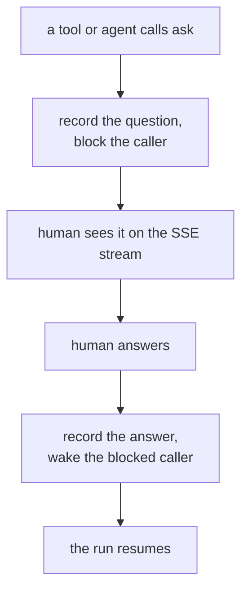

An interaction pauses a run to ask a person a question and blocks until they
answer or the question times out. The `ask` tool is the core capability: it
suspends the caller mid-run, records the question, and wakes the caller with the
answer.

This page explains the model — asking a **person**. An `ask` can also be addressed
to the **run that called this one** (`to="caller"`), which parks and hands the
question up rather than out to a human; that variant is [asking the
caller](/concepts/asking-the-caller). To turn interactions on and answer one, follow
[Use interactions](/guides/use-interactions).

## The loop


```mermaid
flowchart TD
    A["a tool or agent calls ask"] --> B["record the question,<br/>block the caller"]
    B --> C["human sees it on the SSE stream"]
    C --> D["human answers"]
    D --> E["record the answer,<br/>wake the blocked caller"]
    E --> F["the run resumes"]
```

`ask` is the engine-agnostic author surface behind the contract's `Ask`
protocol. Loading it is manifest-driven: opt in the interactions tool module and
the interactions HTTP router, exactly like any other capability.

## Sync and async

A question also declares a **wait discipline**, `mode`:

- **`sync`** (the default) blocks the caller. The loop above is the sync loop: the
  caller waits on the answer or the `timeout`, then the typed answer returns (or the
  call raises).
- **`async`** parks the caller. `ask` records — and, over a channel, delivers —
  the question exactly as sync does, but returns a **suspension sentinel**
  immediately instead of blocking. A later answer, or the question's expiry, resumes
  the run out of band.

An async park always carries a deadline: `expiry_at`, a timezone-aware moment. It is
**required** for `async` — a park with no deadline could never expire, so the ask
raises without it — and **mutually exclusive** with a sync `timeout`, which bounds
the same wait the other way. `expiry_at` is valid only with `mode="async"`.

A parked question is answered **out of band** — through the ordinary authenticated
answer door or the channel callback, exactly as a sync question, never inline. When a
human answers, the run resumes on its own: a stored continuation runs under the
**asker's** identity (never the answerer's), exactly once.

What a **lapsed** `expiry_at` does is the park's **`on_expiry`** policy:

- **`kill`** (the default) tears the whole run chain down. The parked run — and every
  run linked above it — is failed, and a door that started it with a receiver is
  delivered a single failure. An unanswered deadline ends the work rather than
  resuming it.
- **`resume`** resumes the continuation with a reserved *interaction expired* marker
  in place of an answer, so the run takes its **expiry branch** rather than a real
  answer. Choose it when the run has an expiry path to run.

Either way the expiry is stated once as an `interactions_ask_expired_unanswered`
platform event a deployment can [hook](/concepts/hooks) on.

A resumed run ends in exactly one of **three terminal outcomes**, and the platform
delivers each differently to the person who was asked:

- **succeeded** — the run finished; its answer is delivered back.
- **failed** — the run broke, or its `on_expiry="kill"` deadline lapsed; a single
  uniform failure notice is delivered.
- **withdrawn** — the platform took the run down **on purpose** (a cancel, or the ask's
  thread or person was erased). There is no outcome and **nothing is said to the
  person**: the run is closed quietly.

### Withdrawing a channel-delivered ask

Cancelling a pending ask (`POST /api/interactions/{id}/cancel`, the `cancel_parked`
tool, a route's cancel expression) — or erasing the thread or person it belongs to —
**withdraws** it. When the ask was delivered over a channel that holds one pending
question per address (WhatsApp, Twilio SMS), the withdrawal **releases that
reservation at once**, so the next ask to the same address is accepted immediately
rather than refused until the held reservation times out. The person is told nothing
(the run's terminal is *withdrawn*, not a failure notice); the question already sent
stays in their chat, and a later reply to it bridges in as a **fresh turn** — the same
path a reply to an expired ask takes.

Async requires the run to be resumable: it must be raised where a resuming driver
and a bound execution identity are in scope, or it raises loudly rather than
silently blocking.

Async also requires a **durable, cross-worker checkpointer** — `redis` or
`postgres`. The continuation may resume on a different worker than the one that
parked the run, so its checkpoint must live in shared storage; an in-memory,
sqlite, or checkpointing-disabled setup cannot cross that boundary, and an async
park on one raises loudly.

### Parking several at once

A run can raise more than one async `ask` before it suspends — a parallel
fan-out that parks on all of them together. Each ask is independent: it carries its
own `expiry_at`, and its answer or expiry can arrive in any order, from any surface,
on any worker. The run buffers each resolution durably and resumes **once**, when
the **last** ask resolves — never once per answer, and never part-way on a partial
set. A mix of real answers and `on_expiry="resume"` expiries resolves the same way: an
expired ask contributes the reserved *interaction expired* marker to its own branch
while its siblings contribute their answers, and the single resume carries them all
together. An `on_expiry="kill"` ask that lapses is different — it tears the whole
fan-out down rather than resuming it. A lone async ask is the one-ask case of this
same path.

### A flow or an agent parks

The resuming driver is engine-agnostic: a flow and an agent run are both drivers.
An agent whose tool raises an async `ask` parks the whole agent run and resumes
it on the answer or expiry exactly as a flow resumes — the same stored continuation,
the same asker identity, the same once-only resume. Parking an agent run needs the
same durable, cross-worker checkpointer as any park (`redis` or `postgres`); an agent
run on an in-memory or sqlite checkpointer refuses the async ask loudly rather than
parking a run nothing could resume. It also needs the agents package's own durable
park index — a configured Redis that reverses a parked interaction id back to the
run that parked it, independent of the checkpoint provider; a park-capable run with
no park index configured refuses the async ask loudly before any state is written.

Parallel subagents each park in one step: when several nested subagents raise an
async `ask` together, all their parks collapse into one suspend, and the run
resumes **once** when the last of them resolves — answers and expiries arriving in
any order, from any surface, on any worker, exactly as parallel asks resolve on a
flow.

When a parked agent was reached over a chat channel, its resumed final reply is
posted back into the originating conversation thread, so the late answer lands where
the person is talking. A parked **tool or flow** turn reached over that same channel
delivers its resumed reply back the same way — mapped through the route's reply
mapping — so a conversation target of any kind lands its late answer in the same
thread.

### Deadlines and retention

An async ask's `expiry_at` is the **deadline** — the moment the question stops
mattering, which fires its [`on_expiry`](#sync-and-async) policy. The **checkpoint retention** is a
different clock: the paused run's checkpoint lives in the checkpointer's own store,
kept forever unless the deployment bounds it deliberately, after which a sweep
reclaims the idle thread. The two must agree. If a paused run's checkpointer evicts idle threads at a
bounded retention horizon, an async ask whose `expiry_at` lies beyond that horizon
would lose its paused graph before the answer or expiry ever arrives — so the park
is refused **loudly when it suspends**, naming the interaction, its `expiry_at`, and
the horizon it exceeded. A keep-forever retention has no horizon and never refuses.

## Answer formats

A question declares one of five answer formats. Four are answered on an
authenticated **in-client** surface — the caller waits while a person responds
through the answer door:

- **`text`** — free text.
- **`confirm`** — a yes/no acknowledgement.
- **`select`** — a choice from options.
- **`form`** — a typed payload validated against a declared schema. Answered
  in-client through the answer door, or — over a [channel](#delivering-to-a-channel)
  that supports forms — rendered as that channel's own form surface (see the
  [channel capability matrix](/concepts/notifications#channel-capability-matrix) for
  what each renders).

The fifth format is **`external`**: the human acts on an outside surface — signs a
document, approves a request, confirms an action — and the external system delivers the answer
back through a public callback door. The asking tool blocks exactly as it does for
any other format; only the delivery channel differs.

### Prefilling, per-send options and pages

A `form` ask can refine its schema per send with two optional keys, both generic to
every consumer and channel:

- **`data`** — a per-send overlay on the schema. `data.values` prefills top-level
  properties with known answers (keyed by property name), so the person confirms or
  edits rather than typing from scratch. `data.options` supplies per-send choice
  lists (keyed by property name) that replace a string property's `enum` for this one
  send — each option a `value` (what the answer carries) and an optional `label` (the
  text shown in its place) — so a variant needs no republished form.
- **`pages`** — an ordered list of pages, each a `title` and the property names it
  groups, splitting a longer form into steps. Every top-level property appears
  exactly once across the pages; an absent `pages` is a single page.

Both are validated against the schema before the ask is sent: an unknown property, a
value that fails its property's schema, options on a non-string property, or a page
that misses, repeats, or names an unknown field raises loudly, naming the field. A
channel that cannot honor per-send data refuses at delivery — naming the field —
rather than dropping it silently.

```json
{
  "schema": {
    "type": "object",
    "properties": {
      "date": {"type": "string", "format": "date"},
      "count": {"type": "integer"},
      "notes": {"type": "string"}
    },
    "required": ["date", "count"]
  },
  "data": {
    "values": {"count": 2},
    "options": {
      "date": [
        {"value": "a", "label": "Option A"},
        {"value": "b", "label": "Option B"}
      ]
    }
  },
  "pages": [
    {"title": "Basics", "fields": ["date", "count"]},
    {"title": "Extras", "fields": ["notes"]}
  ]
}
```

The prefilled `count` arrives filled in, `date` offers the two labelled choices this
send provides, and the form reads as two steps. The same `data` and `pages` carry to
every surface that renders the form.

### Multiple choice and radio

Besides a scalar, a form property may be an **array of strings** — a
**multiple-choice** field whose answer is the list of chosen values. Declare it as an
`array` whose `items` are a `string`, optionally with an `items.enum` (or a per-send
`data.options` list) for the choices:

```json
{
  "type": "object",
  "properties": {
    "regions": {
      "type": "array",
      "items": {"type": "string", "enum": ["emea", "amer", "apac"]}
    }
  }
}
```

A single-choice field stays a `string` with an `enum`. How a choice list renders is
the surface's call, decided by the option count against one shared, documented
threshold — `RADIO_OPTION_THRESHOLD` (**5**): a list **at or under** the threshold
renders as a radio group (for a single-choice `string`+`enum`) or a checkbox group
(for an array-of-strings), a longer one as a dropdown or multi-select. Every surface
draws the same short list the same way. A [per-send `data.options`](#prefilling-per-send-options-and-pages)
list replaces the choices for one send, for an array-of-strings field exactly as for
a scalar `enum`.

### Date constraints

A date property — a `string` with `format` `date` or `date-time` — may carry
platform date-constraint keys, validated when the form is built and **enforced on the
answer at every door**:

- **`minDate`** / **`maxDate`** — inclusive `YYYY-MM-DD` bounds.
- **`unavailableDates`** — a list of excluded days, each a `YYYY-MM-DD` date or a
  lowercase weekday name (`monday` … `sunday`) excluding that weekday.

```json
{"type": "string", "format": "date", "minDate": "2026-01-01", "maxDate": "2026-12-31", "unavailableDates": ["2026-07-04", "saturday", "sunday"]}
```

A **date range** is **two ordinary date fields**, never one combined value. The
**end** field names its start field in `rangeStart` and carries the span bounds
`minDays` / `maxDays` (inclusive day counts); each field's answer stays the plain date
string its type declares:

```json
{
  "type": "object",
  "properties": {
    "start": {"type": "string", "format": "date"},
    "end":   {"type": "string", "format": "date", "rangeStart": "start", "minDays": 1, "maxDays": 14}
  }
}
```

The answer door enforces the ordering (`end` on or after `start`) and the inclusive
span from the two submitted values — identically whether a surface drew them as two
inputs or as one native range control mapped to the two fields, so nothing is ever
recombined. A nonsensical constraint — a date key on a non-date property, `maxDate`
before `minDate`, a `rangeStart` naming an undeclared or non-date property, `minDays`
above `maxDays`, or a span key on a field with no `rangeStart` — is refused loudly
when the form is built, naming the property. Each key renders as the matching native
control where a surface has one (see the [capability table](#form-capabilities-per-channel));
where a surface cannot bound its date control, the bound is still enforced on submit.

### Conditional fields

A property may carry a **`visibleWhen`** predicate making its visibility depend on
another field's value — `{"field": <other property>, "equals"|"in"|"notEmpty": …}`,
exactly one operator per predicate:

```json
{
  "type": "object",
  "properties": {
    "has_account": {"type": "boolean"},
    "account_id":  {"type": "string", "visibleWhen": {"field": "has_account", "equals": true}}
  }
}
```

`equals` is visible when the named field equals the value, `in` when it is one of a
non-empty list, `notEmpty` (which must be `true`) when it is present and not an empty
string / list / object. The named `field` must be another declared property.

**The effective-answer rule.** Whether a field is part of the answer is decided by its
predicate **evaluated on the submitted values**, at the single answer facet, so it
holds on **every** answer door — authenticated, callback, channel-forwarded, and the
expiry path alike. A field hidden by that evaluation is **removed from the answer**
the consumer receives: it is not required, not validated, and a value submitted for it
— filled before it was hidden, or filled on a surface that degraded to drawing every
field — is **dropped, never an error**.

### Display elements and a review page

A page may carry ordered **display blocks** beside its input fields — a `heading`, a
`body`, or an `image` — through its optional `display` list, and may be a terminal
**review** page:

```json
{
  "title": "Summary",
  "fields": [],
  "kind": "review",
  "display": [
    {"kind": "heading", "text": "Review your entry"},
    {"kind": "image", "src": "https://cdn.example.com/logo.png", "alt": "Acme"},
    {"kind": "body", "slot": "total"}
  ]
}
```

A `heading`/`body` block carries `text`; an `image` block carries a `src` and an
optional `alt` (the text a surface that cannot draw the image shows instead). A block
is either **static** (its `text`/`src` given here) or declares a **`slot`** — a name a
[reaction](#forms-that-react-while-open)'s `display` update fills while the form is
open (a computed total is a display slot, nothing special). A slot name is unique
across the form.

A page is an **input** page (`kind: "input"`, the default) or a **review** page
(`kind: "review"`): a terminal summary step that carries **no input fields** (an empty
`fields`). A surface renders a review page as a readback of the entered values
alongside its display blocks and the confirm/submit control.

## Media on a question

A question can carry optional **media** — images and links shown WITH it in the
inbox, above the answer controls. Media is **display-only**: the person still
answers through the question's `answer_format`, and the media never becomes part
of the answer. It is orthogonal to the answer format — valid with every one — and
renders with the question both while it is pending and after it is answered.

<Frame caption="The Interactions inbox rendering a question's media — images and links shown above the answer controls.">
  
  
</Frame>

Each item is a `MediaItem` — a `kind`, a `url`, an optional `caption`, and (for a
document) an optional `filename`:

```json
{"kind": "image",    "url": "https://cdn.example.com/chart.png",  "caption": "The weekly chart"}
{"kind": "document", "url": "https://cdn.example.com/report.pdf", "filename": "report.pdf", "caption": "Q3 report"}
{"kind": "video",    "url": "https://cdn.example.com/clip.mp4",   "caption": "The walkthrough"}
{"kind": "audio",    "url": "https://cdn.example.com/note.mp3"}
{"kind": "link",     "url": "https://docs.example.com/reports",   "caption": "Open the full report"}
```

- **`kind`** — one of five. The **file kinds** `image`, `document`, `video`, and
  `audio` carry a fetchable body and render as the matching bubble (an `image`
  inline, the others as the matching file element); a `link` renders as a labelled
  anchor the person clicks through.
- **`url`** — the source. A file kind is an absolute **`https`** URL or a same-origin
  **`/api/interactions/media/<id>`** reference to media the deployment serves by id;
  `image` **additionally** admits an inline `data:image/*` URI (that inline form is
  image-only — a `data:` URI on any other kind is refused). A `link` is an absolute
  **`http(s)`** URL. Remote file media is https-only: the inbox content-security policy
  admits `https:`, `data:`, and same-origin sources but not `http:`, so an `http:`
  file source would be a record that could never render — it is rejected up front, not
  silently dropped. Anchors are not governed by that policy, so an `http:` link stays
  valid.
- **`caption`** — optional accessibility text: an image's alt text, a file's label, or
  a link's display label.
- **`filename`** — optional suggested display name for a **`document`** download; it is
  meaningful only on a `document` item and is refused on any other kind.

### Caps

Media and the question text are bounded by the contract. These are wire-contract
properties — they bound the ask (and notify) **request** a tool submits, not a
replay — not operator settings:

| Cap | Value | What it bounds |
|---|---|---|
| `QUESTION_MAX_CHARS` | 8192 | one question's text |
| `MEDIA_MAX_ITEMS` | 50 | items on one ask or notify — a loose abuse guard |
| `MEDIA_URL_MAX_CHARS` | 8192 | one `http(s)`/`https` URL |
| `MEDIA_DATA_URI_MAX_CHARS` | 524288 (512 KiB) | one submitted `data:image/*` URI |
| `MEDIA_CAPTION_MAX_CHARS` | 1000 | one caption |
| `MEDIA_TOTAL_URI_CHARS` | 1048576 (1 MiB) | the summed url text across all items |

`MEDIA_MAX_ITEMS` is a loose platform abuse guard on the item count, not a
per-channel limit: WhatsApp, for one, delivers each image as its own message, so
the guard — not a native per-message envelope — bounds how many items an ask or
notify may carry. The byte caps
bound the submitted request, not a replay: an accepted `data:image/*` image is
stored by reference — the record keeps a same-origin `/api/interactions/media/<id>`
url and the bytes are served from that route for the question's lifetime. The
pending inbox is read as a paged list through `GET /api/interactions`, and the SSE
stream is tail-only, so no historical backlog is replayed whole on (re)connect — a
reconnecting client resumes recent events by [`Last-Event-ID`](#reading-the-stream)
instead.

### Limits

- **Display-only.** Media rides the question, never the answer. The person's
  reply carries no media.
- **Forwarded to channels that render it.** A question always persists to the
  inbox, where its media renders. When the same question is also delivered to a
  [channel](#delivering-to-a-channel), its media rides the delivery too — the channel
  renders it alongside the question. It is a pure enhancement, not structure: a
  channel that renders only text simply ignores it (no capability flag, never a
  refused send). The channel copy carries an **absolute** served url, so a stored
  `data:image/*` image reaches the medium from the deployment's own
  `/api/interactions/media/<id>` route rather than as inline bytes — a channel ask
  that submits a `data:` image therefore needs the deployment's public base URL
  configured, exactly as a media notification does.
- **Privacy.** A remote `https` image is fetched directly by the reader's
  browser, which discloses the reader's IP (and request timing) to the image
  host. An agent that must avoid that discloses nothing by submitting a
  `data:image/*` URI — the deployment stores it by reference and serves the bytes
  from its own `/api/interactions/media/<id>` route, so the reader's browser only
  ever contacts the deployment.
- **Validated before anything is stored.** Invalid media — an empty list, a
  non-`http(s)` link, an image url that is neither `https`, a `data:image/*` URI,
  nor a same-origin `/api/interactions/media/<id>` reference, an over-cap url,
  data URI, caption, or total, a blank caption, or more than `MEDIA_MAX_ITEMS`
  items — raises loudly when the question is built, before any state is written.

## External questions

An `external` question requires a `link`. A string link is a template carrying the
literal `{callback_url}` placeholder; a callable link receives the callback URL,
builds the external resource, and returns its final URL. The returned answer is the
payload the callback delivered — a JSON POST body, or the query params of a
GET confirm flow — validated against the question's schema when one is declared.

`ask_external` packages this as a [transformer extension](/concepts/tools-and-extensions):
it wraps a tool that builds an external resource and drives the whole flow. The
wrapped tool takes a `callback_url` parameter and returns the URL to visit.

## Delivering to a channel

By default a pending question surfaces on the authenticated stream — the Studio
inbox. Passing `channel="<name>"` to `ask` hands delivery to a registered
**channel plugin** (Telegram, Slack, SMS/WhatsApp) instead: the question mints a
public callback ticket exactly like an `external` ask, the plugin pushes it to
the person on that medium, and the reply comes back through the same callback
door. The asking tool blocks exactly as before — only the delivery leg changes.
An unknown channel name, or a delivery failure, raises loudly before the run
would wait on an answer that can never arrive.

A reply that arrives after the question is already gone or expired is not lost:
with a channel route bound it enters the conversation as an ordinary inbound
message; with no bound route it is logged and dropped.

A channel may render a `select` question **natively** — WhatsApp, for instance,
shows the options as tappable reply buttons or a list, and past the medium's
option cap it falls back to a numbered text prompt. How the options render is the
channel's choice; the **answer contract is unchanged**. However the person
responds — tapping a control or typing — the answer is the option **text**,
exactly as a typed reply would deliver it, and it validates against the
question's options the same way.

A `text` question may also carry **`options`** as *suggested replies* — a tappable
shortlist offered alongside the free-text box. Unlike a `select`'s options they
constrain nothing (a text answer still accepts any string): a tap simply submits the
option's own text as the free-text answer. A channel that advertises interactive
support renders them however it chooses; one that cannot falls back to the plain
prompt.

A `form` question rides a channel only when that channel advertises
`supports_form_delivery`; a form sent to a channel without the flag raises loudly,
naming it, before anything is sent. The person fills it on that channel's own form
surface — the [channel capability matrix](/concepts/notifications#channel-capability-matrix)
records what each renders — and the typed answer returns through the callback door,
validated against the schema exactly as the in-client door validates it.

Because a channel form is answered on the server-rendered callback page, its
`schema` must fall in a renderable **subset**, checked when the question is asked —
before anything is stored. The root is `{"type": "object"}` with a non-empty
`properties` map; every property is a scalar (`string`, `boolean`, `integer`, or
`number`) **or an array whose `items` are strings** (a
[multiple-choice](#multiple-choice-and-radio) field); an `enum` — a non-empty list of
strings — is allowed on a `string` property or on an array's string `items`; and
`required`, when present, names only declared properties. A property that is neither a
scalar nor an array-of-strings — a nested object, an array of non-strings, a bare
`anyOf`/`oneOf`/`$ref`, a missing type — is refused with a `ValueError` naming the
property, while an extra constraint keyword alongside a renderable `type` is not
rendered but is enforced when the answer is validated. A date property may also carry
the [date-constraint keys](#date-constraints), and any property a
[`visibleWhen`](#conditional-fields) predicate; both are validated here and enforced
on the answer. A form on the default inbox surface keeps full JSON-schema freedom; the
subset binds only a channel-delivered form.

A `string` property may also carry a **`format`** of `date`, `time`, or `date-time`;
any other `format` value, or a `format` on a non-string property, is refused, naming
the property. The answer door validates the value's shape: `date` is `YYYY-MM-DD` (a
real calendar date), `time` is `HH:MM` or `HH:MM:SS`, and `date-time` is an RFC 3339
timestamp (a mandatory `Z` or `±HH:MM` offset). A `format` alongside an `enum` is
allowed — the enum's choice control is rendered and the format is still validated on
the answer.

Each surface renders a `format` string as its medium's native control where one
exists, and as a plain text input — still validated at the door — where none does:

| `format` | WhatsApp | Slack | Callback page¹ | Web widget | Studio |
| --- | --- | --- | --- | --- | --- |
| `date` | native date picker (returns `YYYY-MM-DD`) | `datepicker` | `<input type="date">` | `<input type="date">` | browser date input |
| `time` | text (validated at the door) | `timepicker` (`HH:mm`, 24-hour, no seconds) | text (validated at the door) | text (validated at the door) | browser time input |
| `date-time` | text (validated at the door) | text (validated at the door) | text (validated at the door) | text (validated at the door) | text (validated at the door) |

¹ The callback page renders the Telegram web-app button, the external-link door, and
the web channel — each answers on the same server-rendered form page. A `date` prefill
must be `YYYY-MM-DD` and a `time` prefill `HH:MM`; a prefill a native control cannot
display (a `time` carrying seconds on Slack, say) is refused when the form is built.

When you don't need to **wait** for the answer, send the form as a
[notification](/concepts/notifications#ask-less-forms) instead: `notify_user` with a
`schema` delivers the same schema-rendered form and returns immediately — no ticket,
no expiry, no validation loop — and the submission enters the conversation as an
ordinary message from the person. The ask is for answers the caller blocks on; the
ask-less form is for submissions that are welcome whenever they arrive.

### Form capabilities per channel

Beyond the scalar fields and `format` controls above, a form's richer capabilities —
[multiple choice and radio](#multiple-choice-and-radio),
[date constraints](#date-constraints), [conditional fields](#conditional-fields),
[display blocks and a review page](#display-elements-and-a-review-page), and
[reacting while open](#forms-that-react-while-open) — each draw on every surface that
can render them, and **degrade by a documented rule** (never silently) where a surface
cannot. A capability a surface cannot draw either renders by the stated degrade or,
where there is no honest approximation, refuses loudly at the ask door.

| Capability | WhatsApp | Slack | Web chat | Telegram | SMS |
| --- | --- | --- | --- | --- | --- |
| date bounds (`minDate`/`maxDate`) | native picker bounds | **degrade**: enforced on submit | native `<input type=date>` min/max | native `<input type=date>` min/max | **refused** |
| unavailable days (`unavailableDates`) | native picker exclusions | **degrade**: enforced on submit | **degrade**: min/max drawn, the rest on submit | **degrade**: min/max drawn, the rest on submit | **refused** |
| date range (two date fields) | two date fields (may draw as one range control) | two datepickers | two date inputs | two date inputs | **refused** |
| multiple choice (array of strings) | checkbox group | multi-select / checkboxes | multi-select | multi-select | **refused** |
| radio for a short list | radio group (`≤` threshold), else dropdown | radio (`≤` threshold), else select | radio (`≤` threshold), else select | radio (`≤` threshold), else select | **refused** |
| display block (heading/body/image) | text/image blocks | section/header/image/context | rendered block | rendered block | **refused** |
| review page | terminal summary screen | final summary group | review step | review step | **refused** |
| conditional field (`visibleWhen`) | client-side show/hide | reactive show/hide, else **degrade**: show all | client-side show/hide | client-side show/hide | **refused** |
| [reacts while open](#forms-that-react-while-open) | data endpoint | block actions → view update | session reaction door | ticket-page reaction door | **refused (loud)** |

The documented degrade rules:

- **Slack has no date-control bounds.** `minDate`/`maxDate` and `unavailableDates` are
  not drawable on its datepicker, so the author's constraint is **enforced on submit**
  (a per-field error keyed to the field), and re-rendered reactively where the form
  also [reacts](#forms-that-react-while-open). The author declares the constraint once;
  the platform guarantees enforcement, even where the control cannot visibly prevent an
  out-of-range pick.
- **A native HTML date input cannot disable arbitrary individual days.** It draws the
  `minDate`/`maxDate` bounds it can and enforces `unavailableDates` on submit; the same
  enforcement guarantee holds.
- **Slack has no native conditional field.** The platform re-renders the modal (a view
  update) to show or hide the field — this uses the channel's reactive **transport**,
  never the consumer's reaction handler, so it is independent of whether the form
  [reacts](#forms-that-react-while-open). Where a surface offers neither a client-side
  conditional nor a reactive transport, the documented degrade **shows every field** and
  the predicate still gates submit through the [effective-answer rule](#conditional-fields).
- **A surface that cannot draw an image** degrades a display block to its `alt`/body
  text, never dropping it.
- **SMS has no form surface.** A form question (and a reacting form) to an SMS channel
  is **refused loudly** at the ask door, before anything is sent.

Per the [effective-answer rule](#conditional-fields) and the single answer facet, a
degraded surface that draws a hidden field changes no outcome: the value is dropped on
submit. The **web chat** draws every capability above — it is a full form surface, not
a degraded one.

### When a channel reply doesn't match

On a chat medium the person can type anything, so a channel-delivered ask may receive
a reply the answer door **rejects** (a `400` — the reply doesn't fit the question's
format). What happens next is the ask's **`on_mismatch`** policy, set per ask by the
tool author:

- **`retry`** (the default, and today's behaviour) — the ask stays parked and the
  person is told what's expected, so they can answer again in place. The optional
  **`mismatch_notice`** replaces the platform's built-in retry line with your own text;
  a literal `{reason}` token in it is filled with the door's rejection reason by a plain
  substitution (a notice without the token is sent verbatim). A channel that owns its
  own correction surface renders the door's specific reason itself and ignores
  `mismatch_notice`.
- **`bridge`** — an unmatched reply is treated as a **digression**: the ask stays
  parked with **no** notice, and the reply is handed to the
  [conversation](/concepts/client-conversations) as a fresh routed turn so the flow
  handles it. The ask then ends only by a real answer or its timeout, never by
  unmatched input. `mismatch_notice` is ignored under this policy — a digression never
  notifies.

Both policies keep the ask alive; they differ only in whether an off-format reply
re-prompts the person or is routed onward as a new turn.

### Enrichment on the answer

When the person answers by **tapping** a control the channel offered, the tap may
carry channel-specific context back with the answer — the tapped option's author-set
`id`, a template button payload, a referral. A channel surfaces it as opaque
**`params`** on the answer (for example Slack forwards a tapped reply's id as
`params.reply_id`; WhatsApp surfaces its tap enrichment on the bridge path
instead), which the asking flow reads **beside** the `answer`. It is the
answer-path counterpart of the same enrichment a
[bridged conversation turn](/concepts/client-conversations) carries: bounded as
transport, carrying **no trust or meaning** the platform attaches — a plain typed
answer carries none.

## Forms that react while open

A form can **react while the person is filling it** — recompute a value, replace a
field's choices, show a per-field error, or fill a display slot — by naming a
**reaction handler** at ask time. The handler is a registered tool the consumer owns;
the platform runs it and validates what it returns, naming no consumer concept.

Two fields turn a form into a reacting one, both optional and defaulting to today's
static form:

- **`reaction_tool`** — the name of a registered tool run whenever a declared trigger
  fires. It runs through `run_tool` under the park's **rebound identity and state
  context** (the same the [continuation](#sync-and-async) uses), so a reacting form
  **must** be `mode="async"` with `answer_format="form"` — the request raises loudly
  otherwise.
- **`reactions`** — declares WHEN it reacts, as plain renderer-readable form
  description. Three event kinds, each absent by default:
  - **`field_changed`** — the input fields whose change triggers a reaction;
  - **`page_advanced`** — the page titles whose advance triggers one;
  - **`submitted`** — whether the submission is checked by a reaction before it is
    accepted.

```json
{
  "schema": {"type": "object", "properties": {"day": {"type": "string", "format": "date"}, "slot": {"type": "string", "enum": ["09:00", "13:00"]}}},
  "reactions": {"field_changed": ["day"], "choices": ["slot"], "submitted": true}
}
```

A `reaction_tool` with no trigger, or a `reactions` block with no handler, is refused
— the two are halves of one declaration.

### The handler contract

The handler receives exactly three things: the `interaction_id`, the `event` (its
`kind` and the `field` or `page` it concerns), and the partial `values` filled so far.
It returns a **form update** — validated against this form's own schema before it
reaches the surface:

| Key | Fills | Validated |
| --- | --- | --- |
| `values` | field values to set | declared fields only |
| `options` | choice lists to replace | option-bearing fields (string-enum or array-of-strings) only |
| `errors` | per-field error messages | declared fields only |
| `display` | display-slot values | declared [display slots](#display-elements-and-a-review-page) only |

A computed total is not a special case — it is a `display` slot the reaction fills.

### Reaction-fed choices

A reaction may **replace a field's choice list** while the form is open (the slots for
a date just picked, say). Such a field is named in **`reactions.choices`**. Because its
choices are no longer the ones the form was sent with, the platform's submit check
validates its **type only**, never membership in the send-time list — membership is the
consumer's, checked at the `submitted` event. A form declaring any `choices` field
therefore **must** also set `submitted: true`, or the request is refused loudly: an
unvetted reaction-fed value always meets a consumer submit check.

### A unique page title

A `page_advanced` trigger keys a page by its **title**, so a title shared by two pages
names an ambiguous advance. A `page_advanced` trigger on a form whose `pages` repeat a
title is refused at the ask door — give each page a unique title.

### The deadline, and failing loudly

The handler is bounded by a deadline (`INTERACTIONS_REACTION_DEADLINE_SECONDS`, default
`10`) at the single reaction chokepoint. A handler that raises, times out, or returns
an update naming a field or slot the form does not declare **surfaces loudly** — the
person sees the surface's error and the server logs it — never a stale or silently
dropped value. A reaction is **stateless for the durable record**: it never records an
answer, never resolves the interaction, and never rewrites the stored request. The
half-filled form lives on the surface until submission; the `submitted` event is where
the consumer accepts or refuses the whole form. The **server** runs the `submitted` check
on every answer door before it records — the authenticated answer door, the channel
callback, and a caller resume alike — so a surface that runs it first only shows errors
early and can never bypass it: the handler's per-field errors keep the form open, and only
a clean run records the answer.

### How a reaction reaches the handler, per surface

A reaction travels to the one chokepoint by the **same door that answers the form on
that surface**, by that surface's own correlation — the reaction door inherits the
answer door's model and adds nothing:

- **Web chat** — the web plugin's own session-authenticated, same-origin door, a
  sibling of its answer door; the ticket is kept server-side and never reaches the
  browser, and that door forwards the event server-side to the interaction's react
  door.
- **Ticket page** (the external-link page, and the webview a messaging channel opens) —
  the ticket in the page's address is the capability, so the page posts to the ticket's
  react door.
- **In-app** (`channel=None`) — the authenticated react door, a sibling of the
  authenticated answer door, under the same correlation and audience gate.
- **A messaging channel** — the vendor request authentication the channel already
  relies on inbound (WhatsApp's signed, encrypted data-endpoint request and the per-send
  flow token bound to the one interaction; Slack's signed request and view metadata).
- **SMS** — cannot react; a reacting form is refused at the ask door.

A surface advertises the reaction capability only when it really routes a reaction
end-to-end to that one chokepoint.

### Security

The reaction is reachable by whoever may answer the form **on that surface**, by that
surface's own correlation, and by nothing weaker — it inherits the answer door's model
of that surface and adds nothing of its own. Only the handler the asker named at ask
time runs, under the asker's rebound identity; the caller chooses neither the tool nor
the identity and supplies only this form's field values. A reaction is a
**read-and-compute** step — what the handler reaches is what that identity reaches,
exactly as the [continuation](#sync-and-async) does, and **effects belong to the
continuation after the answer**, not to the reaction. What comes back is only the
validated form update, bounded by the **same size and depth caps and request limits**
the answer door has.

### WhatsApp data endpoint (operator setup)

A reacting form on WhatsApp is published as a native Flow with a **data endpoint** Meta
calls as the person fills it. The endpoint decrypts each request, so before a reacting
form can be published the operator provisions the vendor's key material (loud failure
when any is missing — a reacting form never publishes silently inert):

- generate a business **RSA-2048 key pair**;
- set the **private key** as the secret `CHANNEL_WHATSAPP_FLOW_PRIVATE_KEY` (with
  `CHANNEL_WHATSAPP_FLOW_PRIVATE_KEY_PASSPHRASE` if the PEM is passphrase-protected) —
  it is never committed, and a fork configures its own;
- set `CHANNEL_WHATSAPP_FLOW_ENDPOINT_URI` to the public HTTPS URL of the plugin's data
  endpoint (`{public base}/api/channels/whatsapp/flow-data`);
- register the matching **public key** for the sending number — the plugin derives it
  from the private key and registers it, so the operator copies no key material by hand.

A static (non-reacting) WhatsApp form never touches this key material. See the
[channel-whatsapp plugin page](/plugins/tai42/channel-whatsapp) for the full operator
steps.

## The doors

The interactions surface exposes nine HTTP doors. Five are authenticated and four
are public:

| Door | Auth | Purpose |
|---|---|---|
| `GET /api/interactions` | authenticated | paged list of pending questions (`page`/`pageSize`) |
| `GET /api/interactions/stream` | authenticated | tail-only SSE feed of live `add`/`answered`/`removed` frames |
| `POST /api/interactions/{id}/answer` | authenticated | the human answer door (in-client formats) |
| `POST /api/interactions/{id}/cancel` | authenticated | [withdraw](#withdrawing-a-channel-delivered-ask) a pending ask without answering it — fires no continuation, releases the channel's reservation, and says nothing to the person |
| `POST /api/interactions/{id}/react` | authenticated | the in-app [mid-form reaction](#forms-that-react-while-open) door (`channel=None`) — runs the reaction, records nothing |
| `GET /api/interactions/media/{id}` | **public** | serves media stored by reference — the id is the capability |
| `POST /api/interactions/callback/{ticket}` | **public** | the data door — sensitive answers ride the JSON body |
| `GET /api/interactions/callback/{ticket}` | **public** | the redirect door — serves a confirm or schema-rendered form page |
| `POST /api/interactions/callback/{ticket}/react` | **public** | the [mid-form reaction](#forms-that-react-while-open) door for a channel / ticket-page surface — runs the reaction, records nothing |

Publicness is an [access-control](/concepts/access-control) configuration decision,
not a property of the route code.

### Reading the stream

`GET /api/interactions/stream` is a **tail-only** SSE feed: on connect the server
starts from the events-stream tail and sends only live `add`/`answered`/`removed`
frames from that point on. It carries no historical backlog — a freshly opened
client seeds its pending list from the paged `GET /api/interactions` door, then
overlays the live tail.

Every event frame carries an SSE **`id:`** — the events-stream message-id, a
monotonic cursor. A client that reconnects sends the last id it saw back as the
standard **`Last-Event-ID`** request header (a `?last_event_id=` query parameter is
accepted as a fallback for a proxy that strips the header), and the server resumes
the tail **after** that id. So an event that landed during a brief disconnect — a
card's `answered` frame included — is delivered on reconnect instead of being lost
in the gap: a card the client was tracking converges to answered rather than
vanishing.

The resume window is the events stream's own bounded recent-events retention. When
the id is present but cannot cover the gap — malformed, or already aged out of that
window — the server falls back to the tail end and **logs** the fallback, so a
genuinely lost resume is never a silent skip; the client's connect-time refetch of
the paged pending base reconciles the rest. An **absent** id is a normal fresh
connect, not a lost resume: the server tails from the end and the same paged base
seeds the pending state, so this case is intentionally not logged.

## Security in brief

- **The ticket is the capability.** It is a high-entropy bearer token that expires
  on its TTL; single use is enforced by an answered-state guard, and a provider
  retry against a live ticket gets an idempotent `200 already_answered`.
- **GET never mutates.** Link scanners prefetch URLs, so the GET door serves a
  byte-constant confirm page — or, for a channel-delivered form, a page rendered
  from the stored schema — whose form POSTs back; the human's submit performs the
  claim.
- **Uniform 404 and no reflected input.** Unknown, expired, and pruned tickets
  return the same response; callback pages interpolate no request-derived value.
- **Signature verification** runs in core. Bind a
  [webhook verifier](/concepts/triggers-and-webhooks) to an external question and
  the POST door verifies the raw body before the answer is accepted — failing
  closed.

<Note>
External questions require `INTERACTIONS_PUBLIC_BASE_URL` (an `https://` origin,
since the callback URL is a bearer capability) and Redis 7.0+. Callback payloads
arrive through an unauthenticated door, so every stream consumer must treat them
as untrusted.
</Note>

The [use-interactions guide](/guides/use-interactions) walks `ask` across the
answer formats and wires an `ask_external` callback end to end. See
[notifications](/concepts/notifications#ask-less-forms) for the ask-less form — the
non-blocking counterpart to a form ask — the
[HTTP API reference](/reference/api/index) for the interaction routes, and the
[CLI reference](/reference/cli/index) for `tai interactions`.
