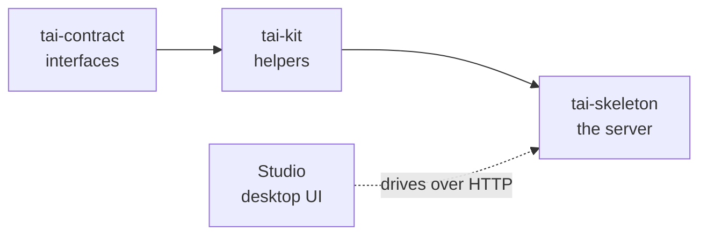

The platform is three Python packages that stack in a strict line, plus a desktop
UI over a running server. Each package depends only on the ones to its left, so
the interfaces stay free of implementation and an alternative server remains
possible.



## tai-contract — the interfaces

`tai-contract` is the pure interface leaf: protocols, ABCs, and pydantic models,
no logic. At runtime it imports nothing but `pydantic`, and its behaviour is a
narrow whitelist — the `tai_app` forwarding handle, model validators, the storage
path guard, and `Agent`'s default stream drain. Vendor types (fastmcp, langchain,
starlette, mcp) appear only inside `TYPE_CHECKING` blocks, so they are never
loaded when the code runs.

Because the contract carries no implementation, a plugin author codes against
stable interfaces — the `Agent` ABC, the `Storage` ABC, the connector and
webhook-verifier protocols — and never against the server's internals.

## tai-kit — the helpers

`tai-kit` is generic leaf helpers: settings primitives, pooled clients, MCP
transports, LLM/embedding factories, the SSRF network guard with its safe URL
fetching, and structured-logging setup. Among tai-* packages its only dependency
is `tai-contract` — it implements the contract's `BaseClient` protocol and
consumes its manifest types. The skeleton reuses these helpers rather than
re-declaring them.

## tai-skeleton — the server

`tai-skeleton` is the framework body: the concrete `TaiMCP` server and the runtime
engines behind every contract protocol — the tool registry and adapters, the agent
registry, the OAuth connector engine, the access-control middleware, the hooks
router, the storage and template manager, the manifest loader, and the transport
layer. It depends only on `tai-contract` and `tai-kit`.

The app is constructed once and exposed as the `tai_app` contract handle. Tools,
agents, and extensions register against it — the same handle every quickstart tool
uses:

```python
from tai_contract.app import tai_app


@tai_app.tools.tool
def greet(name: str) -> str:
    """Greet a person by name."""
    return f"Hello, {name}!"
```

## Plugins register through the handle

Providers — OAuth connectors, storage backends, config providers, worker
backends, monitoring — ship as separate [plugins](/concepts/config-and-secrets).
A plugin registers through `tai_app` when the [manifest](/concepts/manifest)
loads its module; no plugin imports the skeleton. This is what keeps the core
free of provider code and the ecosystem open-ended.

## The Studio

The Studio is the desktop UI over a running server. It calls the same `/api/*`
HTTP surface the `tai` CLI calls, so anything you can do in the UI you can do from
a terminal, and vice versa. The [Studio section](/studio/index) tours its screens
— running tools, the admin console, and API-key provisioning.

See the [Python SDK reference](/reference/python-sdk/index) for the exact
public surface of `tai-contract`, `tai-kit`, and the skeleton.
