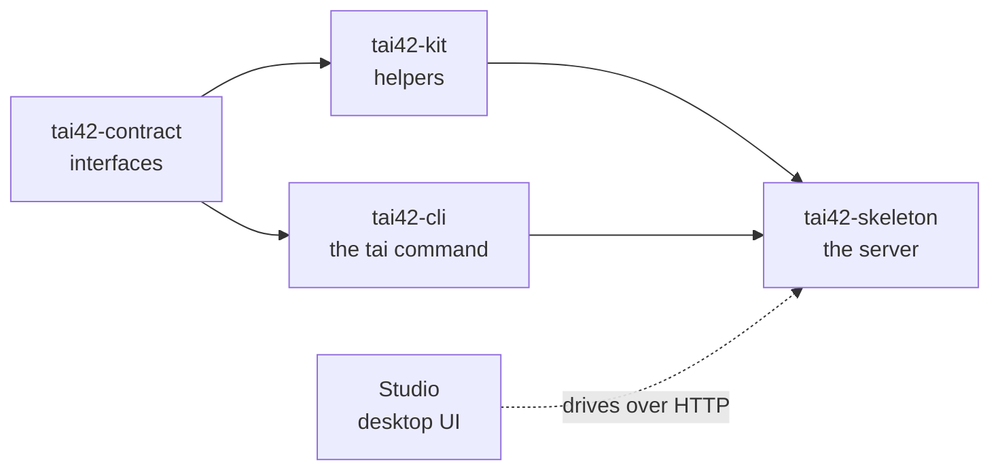

The platform is four Python packages linked by strict dependency edges, plus a
desktop UI over a running server. Each package depends only on packages nearer
the `tai42-contract` leaf, so the interfaces stay free of implementation and an
alternative server remains possible. Two edges run from the contract: the server
path (`tai42-contract` → `tai42-kit` → `tai42-skeleton`) and the command-line path
(`tai42-contract` → `tai42-cli` → `tai42-skeleton`).



## tai42-contract — the interfaces

`tai42-contract` is the pure interface leaf: protocols, ABCs, and pydantic models,
no logic. At runtime it imports nothing but `pydantic`, and its behaviour is a
narrow whitelist — the `tai42_app` forwarding handle, model validators, the storage
path guard, and `Agent`'s default stream drain. Vendor types (fastmcp, langchain,
starlette, mcp) appear only inside `TYPE_CHECKING` blocks, so they are never
loaded when the code runs.

Because the contract carries no implementation, a plugin author codes against
stable interfaces — the `Agent` ABC, the `Storage` ABC, the connector and
webhook-verifier protocols — and never against the server's internals.

## tai42-kit — the helpers

`tai42-kit` is generic leaf helpers: settings primitives, pooled clients, MCP
transports, LLM/embedding factories, the SSRF network guard with its safe URL
fetching, and structured-logging setup. Among tai42-* packages its only dependency
is `tai42-contract` — it implements the contract's `BaseClient` protocol and
consumes its manifest types. The skeleton reuses these helpers rather than
re-declaring them.

## tai42-cli — the `tai` command

`tai42-cli` owns the `tai` command. On its own it is the standalone remote client:
thin groups over a server's `/api/*` routes, plus the CLI-native `completion` and
`version` commands, for operating a running server from any terminal. Among tai42-*
packages its only dependency is `tai42-contract` — it never imports `tai42-kit` or
`tai42-skeleton`, so `pip install tai42-cli` puts the `tai` command on your path
with nothing of the server pulled in.

The command tree is open-ended: a server package contributes its own commands
through the `tai.commands` entry-point group, so the skeleton adds the local and
runtime commands (`serve`, `db`, `doctor`, …) onto the same `tai` tree when it is
installed alongside.

## tai42-skeleton — the server

`tai42-skeleton` is the framework body: the concrete `TaiMCP` server and the runtime
engines behind every contract protocol — the tool registry and adapters, the agent
registry, the OAuth connector engine, the access-control middleware, the hooks
router, the storage and template manager, the manifest loader, and the transport
layer. It depends on `tai42-contract`, `tai42-kit`, and `tai42-cli`, extending the
latter's command tree with its own local and runtime commands.

The app is constructed once and exposed as the `tai42_app` contract handle. Tools,
agents, and extensions register against it — the same handle every quickstart tool
uses:

```python
from tai42_contract.app import tai42_app


@tai42_app.tools.tool
def greet(name: str) -> str:
    """Greet a person by name."""
    return f"Hello, {name}!"
```

## Plugins register through the handle

Providers — OAuth connectors, storage backends, config providers, worker
backends, monitoring — ship as separate [plugins](/concepts/config-and-secrets).
A plugin registers through `tai42_app` when the [manifest](/concepts/manifest)
loads its module; no plugin imports the skeleton. This is what keeps the core
free of provider code and the ecosystem open-ended.

## The Studio

The Studio is the desktop UI over a running server. It calls the same `/api/*`
HTTP surface the `tai` CLI calls, so anything you can do in the UI you can do from
a terminal, and vice versa. The [Studio section](/studio/index) tours its screens
— running tools, the admin console, and API-key provisioning.

See the [Python SDK reference](/reference/python-sdk/index) for the exact
public surface of `tai42-contract`, `tai42-kit`, and the skeleton.
