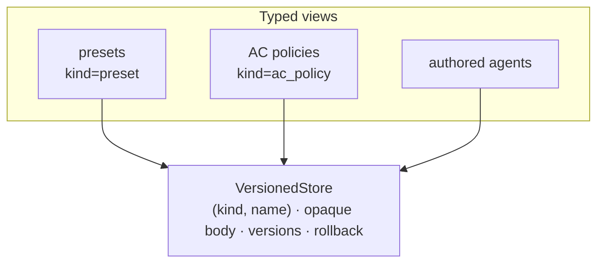

One versioning primitive underpins the platform. Presets, access-control policies,
and authored agents do not each carry their own history machinery — they are typed
views over a single generic versioned-document store. Learn the spine once and it
explains all three.



## The store primitive

The versioned-document store is a `kind`-discriminated, body-opaque persistence
primitive: append-only version rows over an opaque JSONB body, an active-version
pointer, and rollback. Its identity is `(kind, name)` throughout, and every write
is one transaction. The store knows nothing about presets, policies, or agents — it
never inspects the body; the caller owns its shape.

Because identity is `(kind, name)`, a document can be **re-keyed**: `rename`
moves the active document `(kind, name)` to `(kind, new_name)` in one atomic
write. The whole version history, every per-version `tags` label, and the
active-version pointer move untouched — versions key on the document, not the
name, so nothing is copied and the body is never inspected. It raises loudly if
the source has no active row, or if the target name is already a live document. A
[preset](/concepts/presets) rename rides exactly this method.

It is a `runtime_checkable` Protocol, reached from the assembled app as
`app.versioning.store`, with its own record models (`DocumentRecord`,
`DocumentVersion`) and typed errors. Every method raises loudly on a missing,
duplicate, or invalid target rather than returning a silent default.

## Typed views ride the spine

A feature that needs history layers a typed view over the store under its own
`kind`:

- **[Presets](/concepts/presets)** — `kind="preset"`.
- **[Access-control policies](/concepts/access-control)** — `kind="ac_policy"`.
- **[Authored agents](/concepts/agents)** — a spec that versions the same way.

Each view owns the shape of its body and gets versioning, rollback, and
per-version tags from the spine for free. Because they share one primitive, a new
versioned kind is a new view — not a new subsystem.

## Where versions live

The spine's rows live in the framework's versioned-document tables, applied with
the DDL the CLI installs:

```bash
tai db apply
```

<Note>
`tags` on a version is the generic per-version grouping label the store provides.
It is distinct from any categorization a particular kind's body carries — a
preset's own fields, for example.
</Note>

See [presets](/concepts/presets) and [access control](/concepts/access-control)
for the views in use, and the [Python SDK reference](/reference/python-sdk/index)
for the `VersionedStore` Protocol and its record models.
