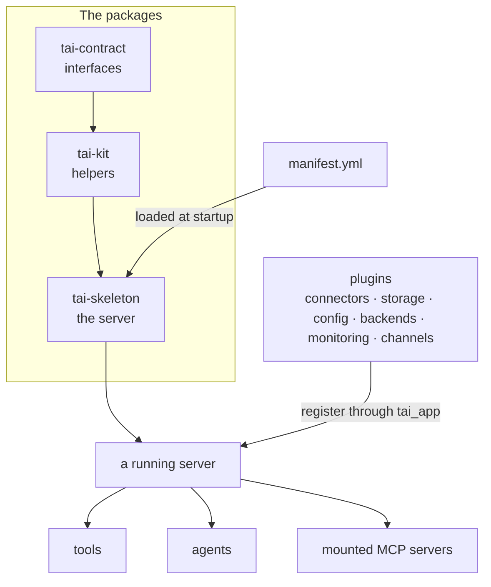

You bring a capability — a plain Python function, an agent, or an external MCP
server — and the runtime supplies the operational layer around it. MCP connects
tools to AI models but does not run them; tai is the server that does.

## The one diagram

Everything a server does hangs off two things: the packages it is built from,
and the manifest it loads.

## The layers

Three packages stack left to right, each depending only on the ones to its left:
`tai-contract` declares the interfaces, `tai-kit` supplies generic helpers, and
`tai-skeleton` is the runnable server that implements the contract. Read
[the layering](/concepts/layering) for the full picture.

Providers you do not write yourself — OAuth connectors, storage backends, config
providers, worker backends, monitoring, channels — ship as separate **plugins**. A plugin
registers through the shared `tai_app` handle when the manifest loads it; no
plugin imports the skeleton.

## The manifest decides everything

A server loads exactly one [manifest](/concepts/manifest) at startup. It names
the tools, agents, extensions, external MCP servers, and plugin modules that make
up that system. Nothing loads automatically — a capability is present because the
manifest names it, and absent otherwise. An empty manifest boots a bare server.

## Tools are the atom

A [tool](/concepts/tools-and-extensions) is the unit of work: a plain Python
function you decorate, or a tool from a mounted MCP server. You clip **extensions**
onto a tool to wrap or transform it into a new variant, and you save a versioned
configuration of a tool as a [preset](/concepts/presets). Around all of this the
runtime adds [access control](/concepts/access-control),
[connectors](/concepts/connectors), [storage](/concepts/storage-and-resources),
[human-in-the-loop steps](/concepts/interactions), and
[live operation](/concepts/live-operations) — each its own pillar.

## Self-contained and yours

Every install is a self-contained system you host yourself. The same HTTP surface
drives both the `tai` CLI and any MCP client, so a server is fully operable from a
terminal as well as from a client such as Claude Desktop or Cursor.
