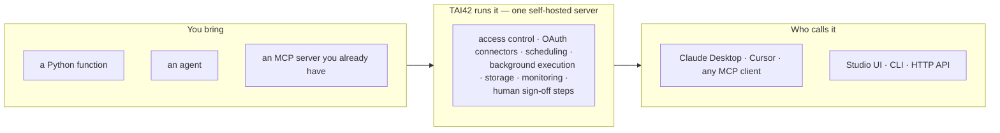

**MCP defines how AI models call tools. TAI42 is where those tools
live.** The protocol doesn't say where a tool runs, who may call it, or
what happens when it needs OAuth, a schedule, or a human sign-off —
TAI42 is that missing server: Apache-2.0, self-hosted, where your
tools, agents, and existing MCP servers run as one system your team
operates.



## One runtime instead of three stacks

Building serious AI tooling today means gluing three things: an agent
SDK for the agents, an MCP framework for the tools, and then the part
you end up writing yourself — access control, OAuth token handling,
background execution, scheduling, storage, monitoring, approval steps.
TAI42 ships all three as one runtime. You write the capability; the
operational layer is already there.

A tool is a plain decorated function; a one-file **manifest** declares
what the server loads (nothing loads implicitly — that's the point:
the manifest IS the system definition):

<CodeGroup>

```python myapp/tools.py
from tai42_contract.app import tai42_app

@tai42_app.tools.tool
def greet(name: str) -> str:
    """Greet a person by name."""
    return f"Hello, {name}!"
```

```yaml manifest.yml
tools:
  - title: hello          # display/group name for this entry
    module: myapp.tools   # imported at startup; the decorator registers greet
    include: [greet]      # which functions from the module to expose
```

```yaml mount an existing server
mcp:                      # servers you already run, mounted as-is
  - title: example-http
    config:
      url: https://mcp.example.com/mcp
  - title: example-stdio
    config:
      command: uvx
      args: [some-mcp-server]
```

</CodeGroup>

`tai serve --manifest-path manifest.yml` — and `greet` is an MCP tool
callable from Claude Desktop, Cursor, the bundled web console (the
Studio), the CLI, or an agent. The auth middleware, the OAuth token refresh, the cron wrapper,
the job queue, the audit trail you were about to write around it —
already running.

**Already have an MCP server?** TAI42 is built on FastMCP and speaks
standard MCP — any server you already run mounts as-is (over HTTP, a
unix socket, or as a stdio process the runtime launches, per the
`mcp:` tab above); its tools appear next to your own, behind the same
auth and monitoring. Nothing needs porting. And when a tool is
sensitive, it can pause for **human sign-off** — answered from the
Studio inbox or a connected chat channel (Slack, Telegram, WhatsApp).

## The server is alive

With plain MCP frameworks, your server is a build artifact — change a
tool, restart the process. A TAI42 server is operated **live**: reload a
tool in place, replace the manifest across every worker process at
once, re-probe and re-attach an external MCP server that was
down, refresh config in place — no restart. Each of these operations is
declared once and exposed three ways — HTTP API, CLI command, and
optionally as an MCP tool your agents can call (an admin chooses which
ones) — so the UI, your terminal, and your agents always drive the same
thing.

## What's in the box

<CardGroup cols={3}>
  <Card title="Tools" icon="wrench" href="/concepts/tools-and-extensions">
    A decorated function or a mounted server's tool. Wrap one with an
    **extension** (rate-limit it, transform it), save a configured
    variant as a versioned **preset**.
  </Card>
  <Card title="Agents" icon="robot" href="/concepts/agents">
    An included agent framework — you author an `Agent` class in
    Python, the runtime runs it and streams every step (messages,
    reasoning, tool calls) live. Models ride standard LangChain
    providers (OpenAI, Anthropic, …) with your own keys, set in
    config. Callable exactly like any tool.
  </Card>
  <Card title="The operational layer" icon="gauge-high" href="/concepts/live-operations">
    Key-based identities with scoped policies checked on every
    request, OAuth connectors, scheduling, background execution,
    storage, monitoring, human sign-off — supplied, not built by you.
  </Card>
</CardGroup>

It's for developers and platform teams who've outgrown a
localhost MCP script and want a system their team operates — on their
own machines, with their own data. Every subsystem plugs in against
shared open interfaces (storage, background-job backends, OAuth
connectors, and chat channels are all swappable plugins), and each install is a self-contained Python server
you run with `uv` or Docker.

## Start here

<CardGroup cols={2}>
  <Card title="Install" icon="rocket" href="/getting-started/installation">
    Install from PyPI and boot a working server in minutes.
  </Card>
  <Card title="Quickstart" icon="bolt" href="/getting-started/quickstart">
    Serve the hello example and call a tool over MCP.
  </Card>
  <Card title="Mental model" icon="brain" href="/getting-started/mental-model">
    How the runtime fits together, in one page.
  </Card>
  <Card title="Marketplace" icon="store" href="/marketplace/index">
    Browse plugins and install into a running server.
  </Card>
</CardGroup>
